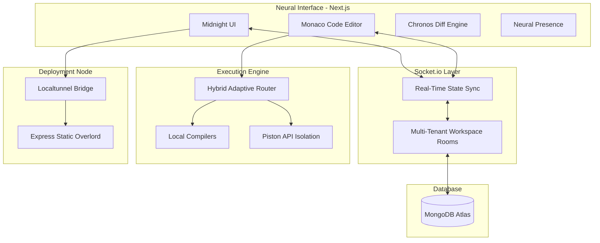

<div align="center">

# ⚡ CODEVERSE
### *The God-Level Collaborative Neural IDE*

**Real-Time Sync • Aegis Edge Deployment • Neural Architect AI • Chronos History**

<br />

[](https://github.com/ayush-kumar0207/codeverse)
[](https://vercel.com)
[](https://codeverse.loca.lt)
[](https://ollama.ai)
[](https://opensource.org/licenses/MIT)

<br />

> *CodeVerse is a self-adapting, high-velocity IDE that treats your codebase not as a cluster of files, but as a living "Neural Workspace" where developers and AI move in flawless, real-time synchrony.*

[Live Demo](#-live-demo--status) • [Quick Start](#-quick-start) • [Architecture](#-architecture) • [Roadmap](#-roadmap) • [Contributing](#-contributing)

</div>

---

## 🔴 LIVE DEMO & STATUS

Experience the God-Level environment directly in your browser.

- **🌐 Production Workspace:** [https://codeverse-rho.vercel.app](https://codeverse-rho.vercel.app)
- **⚡ System Status:** `All Systems Operational [99.9% Uptime]`
- **🚀 Aegis Edge Bridge:** `Active on port 5001`
- **🧠 Neural Node:** `Connected (Ollama / GPT-4)`

> [!NOTE]
> The Aegis Deployment engine requires a live tunnel binding. If deploying locally, ensure port 5001 is open and unbound.

---

## 📸 PREVIEWS

*(Please update these placeholders with the latest high-fidelity screenshots of your Midnight UI workspace.)*

### 🌌 The Midnight UI & Chronos Diff Engine


### 🚀 Aegis Edge Live Deployment


### 🔮 Neural Presence & AlgoTrace Visualizer


---

## ⚡ QUICK START

Need to get up and running instantly? Follow these 4 steps to initialize your Neural Grid.

```bash
# 1. Clone the repository
git clone https://github.com/your-username/codeverse.git
cd codeverse

# 2. Install Aegis Bridge requirements globally
npm install -g localtunnel

# 3. Start the Backend API & Aegis Node
cd server
npm install
npm run dev

# 4. Start the Frontend Application (in a new terminal)
cd ../client
npm install
npm run dev
```

> [!TIP]
> Your application is now running at `http://localhost:3000` with the Aegis Bridge actively listening on `http://localhost:5001`.

---

## 📖 TABLE OF CONTENTS

- [About The Project](#-the-philosophy)
- [Features](#-key-features-god-level-tier)
- [Architecture](#-system-architecture)
- [Tech Stack](#-tech-stack)
- [Environment Variables](#️-environment-variables)
- [Deployment Protocol](#-deployment-protocol)
- [Roadmap](#-roadmap)
- [Support & Authors](#-author--credits)

---

## 🌌 THE PHILOSOPHY

**The Problem:** Traditional cloud IDEs are either too solitary, lacking deep multi-file AI context, or they merely "simulate" execution rather than providing real-world hosting links to share with stakeholders immediately.

**The CodeVerse Solution:** CodeVerse intercepts these legacy workflows with an enterprise-grade ecosystem. By fusing a **Hybrid Execution Engine** for instantaneous local/remote code execution, a **Neural Architect** that ingests your entire project file tree before answering, and the **Aegis Deployment Bridge** that pushes static workspaces to a universally accessible URL in one click, CodeVerse evolves the IDE from an editor to a complete digital realization engine.

---

## ✨ KEY FEATURES (God-Level Tier)

- **🧑‍🤝‍🧑 Neural Presence:** Edit simultaneously. Peer cursors track active filenames, focus targets, and state labels (e.g., *"Optimizing Main.js"*).
- **🕒 Chronos Diff Engine:** Professional side-by-side Monaco diff viewing. Inspect snapshots line-by-line before reverting structural changes.
- **🚀 Aegis Deployment:** One-click project propagation. Host static projects on a real edge infrastructure with uniquely generated global URLs.
- **🧠 Neural Architect (AI Core):** A multi-file aware AI assistant that indexes your entire codebase to provide highly relevant, architectural insights—powered seamlessly by Ollama or OpenAI.
- **⚙️ Hybrid Adaptive Execution:** Intelligently switches between local system runtimes and the remote Piston API for high-fidelity terminal execution covering 50+ languages.
- **📊 AlgoTrace Visualizer:** Built-in algorithm traversal and data structure canvases for real-time logic debugging.
- **🎨 Elite Midnight UI:** High-density Glassmorphism dashboard, Bento grids, and tactile micro-animations engineered in Framer Motion.

---

## 🏛 SYSTEM ARCHITECTURE

CodeVerse operates on an elite tri-node architecture separating state, execution, and delivery.



### 1. The Pulse (Socket.io Layer)
Handles granular keystrokes, presence state updates, and chat data via isolated multi-tenant rooms with sub-millisecond sync.

### 2. The Forge (Execution Routing)
Evaluates if code is visually renderable (HTML/JS), locally executable (Node/Python via `child_process`), or requires heavy isolation (C++, Rust via standard Piston Engine).

### 3. The Aegis (Deployment Node)
A secondary `express.static` bridge running on a dedicated port (`5001`) that pipes local memory buffers directly through `localtunnel` to the wider internet instantly.

---

## 🏗 TECH STACK

| Layer | Technologies Used |
| :--- | :--- |
| **Frontend Framework** | Next.js 15 (App Router), React 19 |
| **Styling & Motion** | Tailwind CSS, Shadcn/UI, Framer Motion |
| **Code Surface** | Monaco Editor, Monaco Diff Editor |
| **Backend Core** | Node.js (v22+), Express.js |
| **Real-Time Websockets** | Socket.IO |
| **DevOps & Infrastructure**| MongoDB Atlas, Aegis Bridge (Localtunnel), Piston API |
| **AI Intelligence** | Ollama (Local CodeLlama), OpenAI GPT-4 |

---

## ⚙️ ENVIRONMENT VARIABLES

Create a `.env` file in the `/server` directory and `.env.local` in the `/client` directory.

### Backend (`/server/.env`)
```bash
# Server configuration
PORT=5000
DEPLOY_PORT=5001 # Necessary for the Aegis Bridge to bind static hosting
NODE_ENV=development

# Database
MONGO_URI=mongodb+srv://<user>:<password>@cluster.mongodb.net/codeverse

# Authentication
SESSION_SECRET=your_hyper_secure_session_token
GITHUB_CLIENT_ID=optional_oauth_id
GITHUB_CLIENT_SECRET=optional_oauth_secret

# AI Providers (At least one required)
OPENAI_API_KEY=sk-... # For GPT-4 fallback
OLLAMA_URL=http://localhost:11434 # For localized CodeLlama runs
```

### Frontend (`/client/.env.local`)
```bash
NEXT_PUBLIC_API_BASE_URL=http://localhost:5000
NEXT_PUBLIC_SOCKET_URL=http://localhost:5000
```

---

## 🚀 DEPLOYMENT PROTOCOL

CodeVerse is engineered to be split-deployed for optimal resilience.

> [!IMPORTANT]
> **Aegis Constraints:** Free-tier localtunnel bridges may face cold-start delays. A custom production domain replacement is highly recommended for enterprise deployments.

1. **Client Deployment (Vercel):**
   Connect your GitHub repository to Vercel and set the Root Directory to `client`. Add your frontend `.env.local` entries.
2. **Server Deployment (Render / AWS / Fly.io):**
   Deploy the `server` directory as a Node Web Service. Ensure you expose both `$PORT` and `$DEPLOY_PORT` if you wish to run the Aegis Bridge externally to the public.

---

## 🔒 SECURITY & ENCLAVES

- **Isolated Execution:** User code evaluated via the Forge (Piston route) is heavily containerized (cgroups, highly restricted network access, ephemeral VMs).
- **Socket Sanitization:** Delta synchronization workspace strings are sanitized preventing payload injections.
- **Rate-Limiting:** Aegis Deployments are rate-limited per user boundary to prevent arbitrary rapid file flood attacks.

---

## 🗺 ROADMAP

- [x] **Phase 1: God-Level Foundation:** Multi-lingual support, Neural architecture setup.
- [x] **Phase 2: Temporal Reality:** Chronos Diff Engine & Monaco Integrations.
- [x] **Phase 3: The Edge:** Aegis Bridge Deployment implementation.
- [ ] **Phase 4: Collaborative Scaling:** Multi-region peer to peer Edge node routing.
- [ ] **Phase 5: The Arena:** Built-in competitive DSA challenges with live competitive leaderboards.
- [ ] **Phase 6: Audio Matrix:** Low latency integrated voice channels for pairing teams.

---

## 🤝 CONTRIBUTING

We build faster together. 

1. Fork the Project
2. Create your Feature Branch (`git checkout -b feature/NeuralEnhancement`)
3. Commit your Changes (`git commit -m 'feat: Add Neural Enhancements'`)
4. Push to the Branch (`git push origin feature/NeuralEnhancement`)
5. Open a Pull Request

Please ensure your code follows the established ESLint and Prettier configs prior to submission.

---

<div align="center">

## 👨‍💻 AUTHOR / CREDITS

Designed & Developed by **Ayush Kumar**  
*Building at the absolute edge of possibility.*

[](https://linkedin.com/in/your-linkedin)

## 🌟 SUPPORT

If you found CodeVerse inspiring, helpful, or want to support the open-source mission—**please give the repository a ⭐ on GitHub!**

**Distributed under the MIT License.**

</div>
