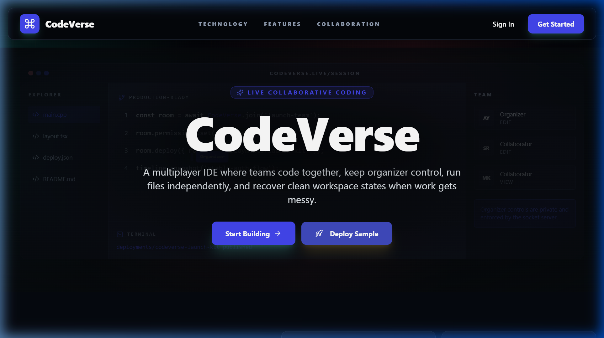
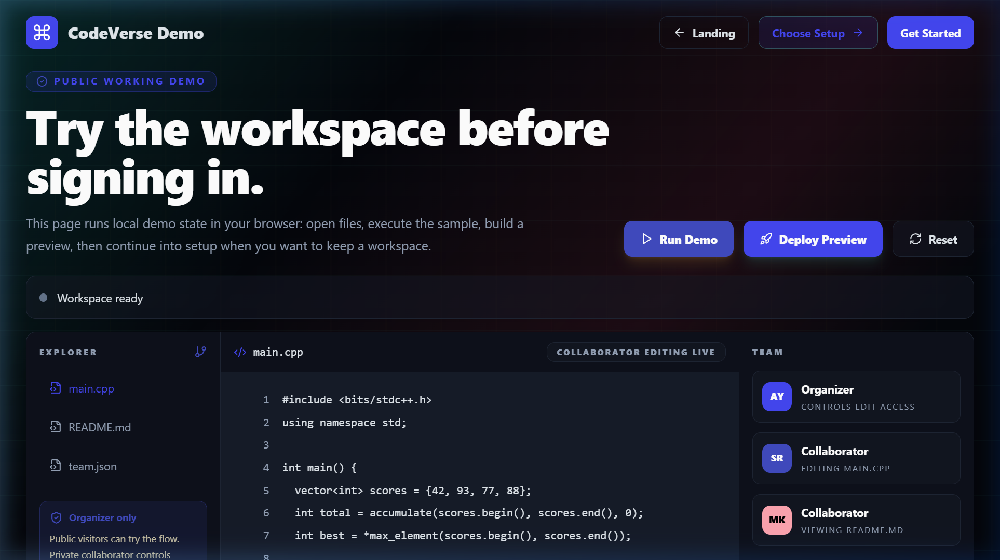
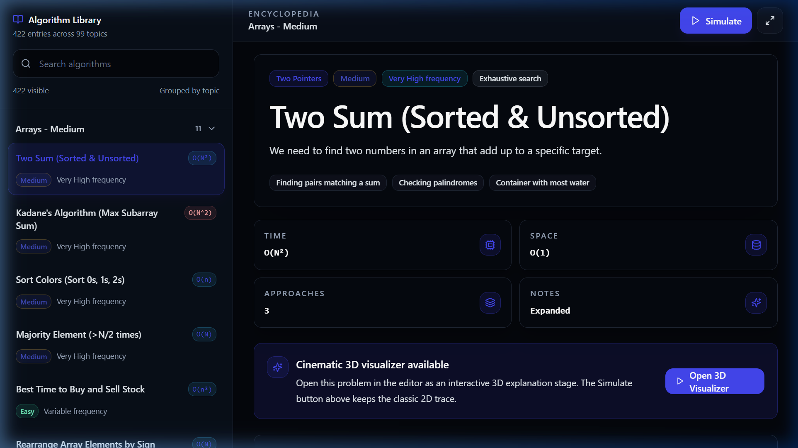
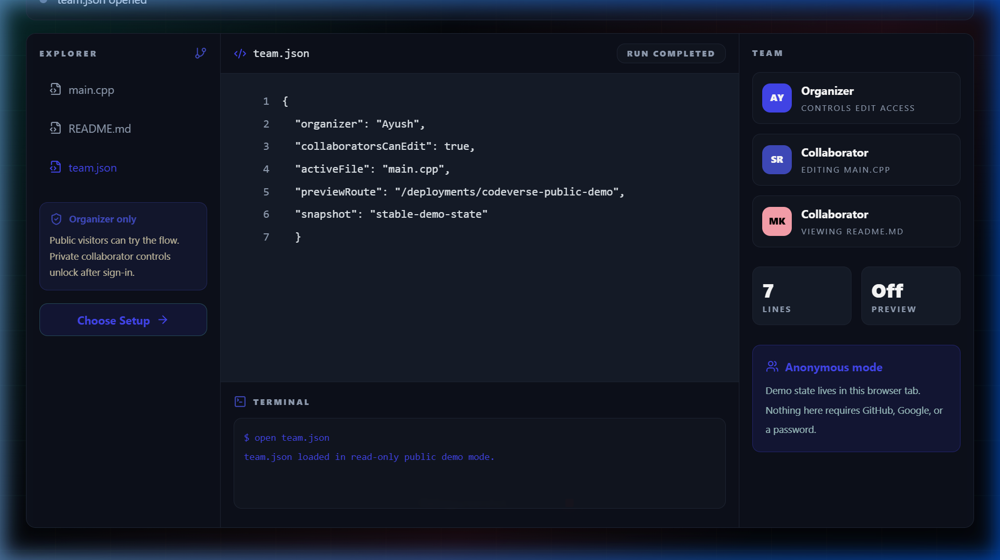
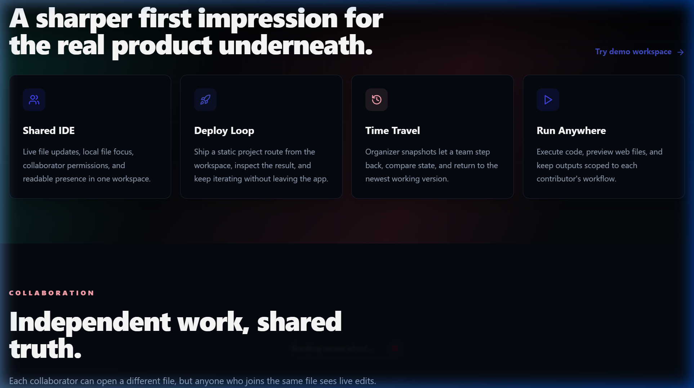
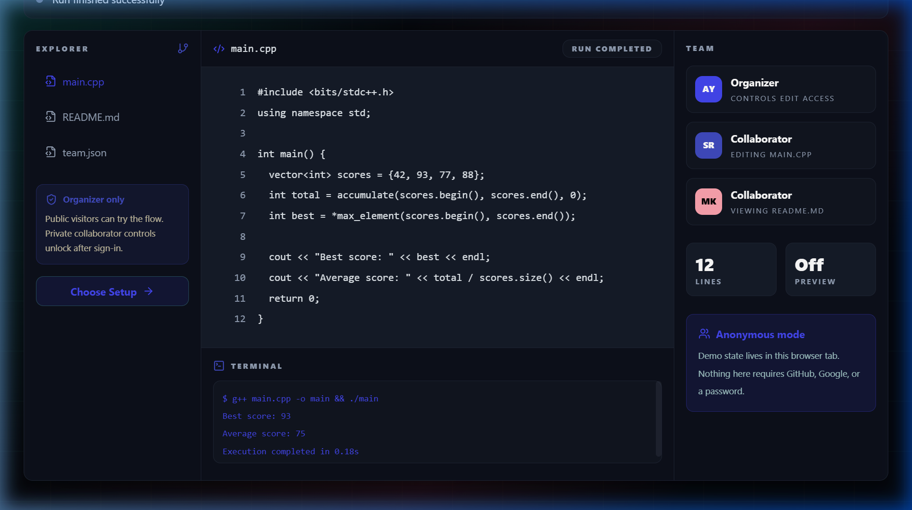
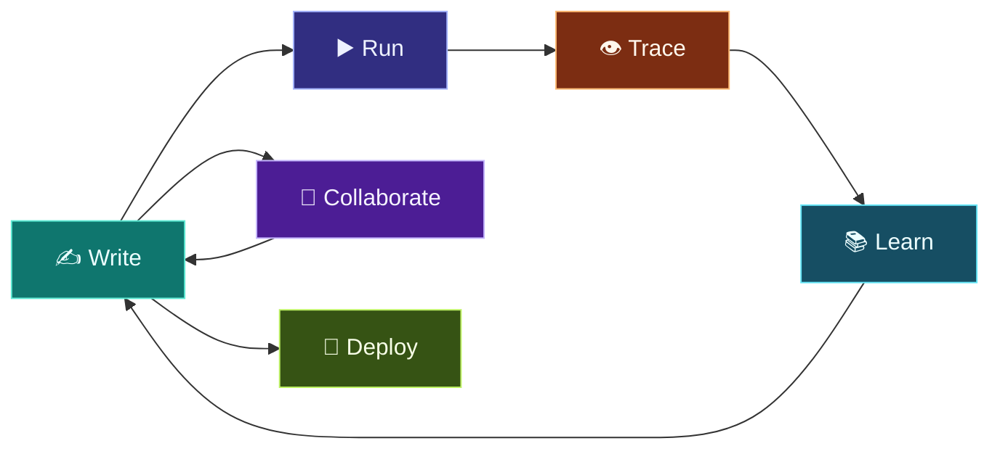
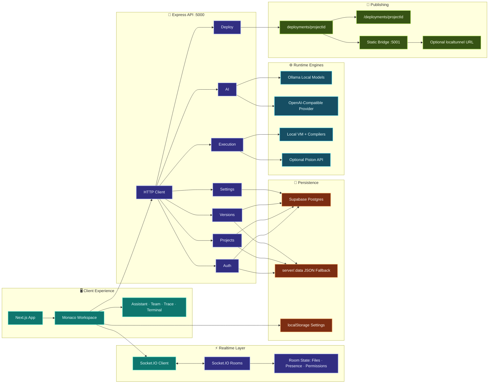
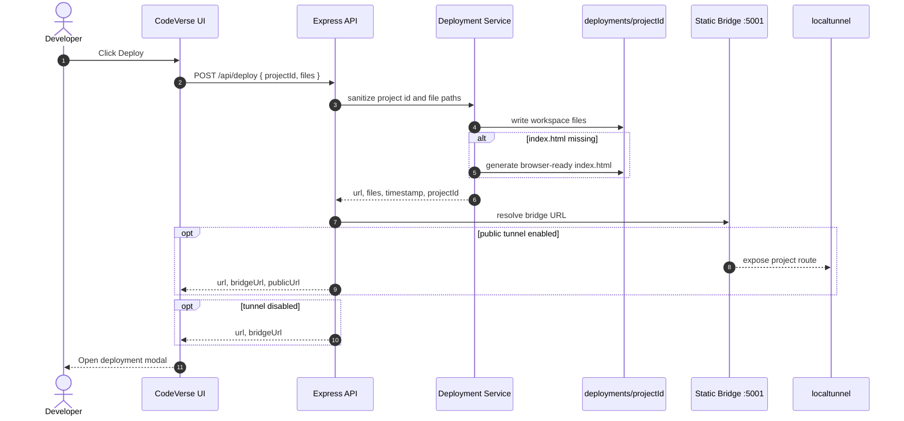

<div align="center">

  # ⚡ CodeVerse

  ### _"Write it. See it. Ship it. — Together."_

  **A real-time collaborative IDE where teams write code, trace algorithms visually, pair with AI, and publish live workspaces — all from one browser tab.**

  <p>
    <a href="https://codeverse-rho.vercel.app"></a>
  </p>

  <p>
    <a href="https://codeverse-rho.vercel.app"></a>
    <a href="https://github.com/Ayush-Kumar0207/codeverse/actions/workflows/ci.yml"></a>
    <a href="https://github.com/Ayush-Kumar0207/codeverse/actions/workflows/codeql.yml"></a>
    <a href="./LICENSE.txt"></a>
    
    
    
    
    
    
    
    
    
    
    <a href="https://github.com/Ayush-Kumar0207/codeverse/pulls"></a>
  </p>

  <p>
    <a href="#-the-problem-why-codeverse-exists">🎯 The Problem</a> •
    <a href="#-features">✨ Features</a> •
    <a href="#-quick-start">🚀 Quick Start</a> •
    <a href="#-architecture">🏛 Architecture</a> •
    <a href="#-api-reference--usage-examples">📡 API</a> •
    <a href="#-author--team">👥 Team</a>
  </p>

</div>

---

## 🔴 Live Demo & Status

<p align="center">
  <a href="https://codeverse-rho.vercel.app">
    
  </a>
</p>

| Surface | URL / Status |
| --- | --- |
| **Production App** | [codeverse-rho.vercel.app](https://codeverse-rho.vercel.app) |
| **Frontend Host** | Vercel |
| **Backend API** | Configure via `NEXT_PUBLIC_API_BASE_URL` |
| **Local Frontend** | `http://localhost:3000` |
| **Local API** | `http://localhost:5000` |
| **Health Check** | `GET http://localhost:5000/api/health` |
| **Deployment Bridge** | `http://localhost:5001/:projectId/` |
| **Public Tunnel** | Optional localtunnel URL when `DEPLOY_TUNNEL_ENABLED=true` |

> **Zero-config local development.** CodeVerse runs locally without cloud credentials for the core IDE flow. Supabase, OAuth, Ollama, and remote execution are optional integrations that unlock persistence, sign-in providers, AI help, and sandboxed execution.

---

## 📸 Preview

<table>
  <tr>
    <td align="center"><strong>Landing Page</strong></td>
    <td align="center"><strong>Demo Workspace</strong></td>
  </tr>
  <tr>
    <td></td>
    <td></td>
  </tr>
  <tr>
    <td align="center"><strong>Algorithm Encyclopedia</strong></td>
    <td align="center"><strong>Collaboration & Team</strong></td>
  </tr>
  <tr>
    <td></td>
    <td></td>
  </tr>
  <tr>
    <td align="center"><strong>Feature Highlights</strong></td>
    <td align="center"><strong>Code Execution</strong></td>
  </tr>
  <tr>
    <td></td>
    <td></td>
  </tr>
</table>

**Quick API test:**

```bash
curl -s -X POST http://localhost:5000/api/execute \
  -H "Content-Type: application/json" \
  -d '{"code":"console.log(\"Hello from CodeVerse\")","language":"javascript","roomId":"demo","user":"local"}'
```

---

## 📖 Table of Contents

- [The Problem](#-the-problem-why-codeverse-exists)
- [How It Works](#-how-it-works)
- [Features](#-features)
- [Tech Stack](#-tech-stack)
- [Architecture](#-architecture)
- [Project Structure](#-project-structure)
- [Quick Start](#-quick-start)
- [Environment Variables](#%EF%B8%8F-environment-variables)
- [API Reference & Usage Examples](#-api-reference--usage-examples)
- [Deployment](#-deployment)
- [Performance & Diagnostics](#-performance--diagnostics)
- [Quality Gates](#-quality-gates)
- [Security](#-security)
- [Roadmap](#-roadmap)
- [Contributing](#-contributing)
- [FAQ](#-faq)
- [License](#-license)
- [Author & Team](#-author--team)

---

## 🎯 The Problem: Why CodeVerse Exists

> _"Why should writing, running, explaining, collaborating on, and deploying code require five different apps?"_

Developers, students, and interview-prep teams hit the same wall every day:

1. **Context Switching** — The editor, terminal, chat app, deployment tool, AI assistant, and learning reference all live in different tabs. Every context switch costs cognitive load and kills flow.
2. **Solo-by-Default Tools** — Most browser IDEs treat collaboration as an afterthought. Sharing code means copy-pasting snippets or screen-sharing. There's no shared cursor, no team chat, no live permission control.
3. **Black-Box Execution** — You run an algorithm and get output, but you never _see_ how it works. Understanding bubble sort from text is different from watching pointers swap in real time.
4. **Learning ≠ Building** — Algorithm references, code execution, and visualization are scattered across LeetCode, Visualgo, and VS Code. None of them connect the loop from "learn" → "write" → "trace" → "deploy."

**CodeVerse solves this.** It is one workspace that fuses a Monaco-powered editor, real-time collaboration rooms, AI pair programming, algorithm visualization, version history, and instant static publishing — all inside a single browser tab.

```
              🧠 Learn                    💻 Write                    👁️ See
                ▲                           ▲                          ▲
                │                           │                          │
    Algorithm Encyclopedia    →    Monaco Editor    →    AlgoTrace Visualizer
                                      │                        │
                               ┌──────┴──────┐         ┌──────┴──────┐
                               │  AI Assist  │         │   Execute   │
                               │  (Ollama /  │         │  (Local /   │
                               │   OpenAI)   │         │   Piston)   │
                               └──────┬──────┘         └──────┬──────┘
                                      │                        │
                                      └────────┬───────────────┘
                                               ▼
                                        🚀 Deploy & Share
                                    (Static Publishing + Tunnel)
```

**The optimal developer experience lives in the intersection of building, learning, and collaborating. That's what CodeVerse occupies.**

---

## 🕹️ How It Works

You open a **workspace**. You're in a Monaco editor with a full file explorer, terminal, and panel system — like VS Code, but multiplayer from day one.

### The Core Loop



1. **Write** — Monaco Editor with custom themes, multi-file workspaces, 11 language starters, and IntelliSense.
2. **Run** — Execute locally (Node VM, Python, GCC, G++, Java) or remotely via the Piston API. See results instantly.
3. **Trace** — AlgoTrace visualizes arrays, matrices, graphs, trees, linked lists, heaps, stacks, queues, recursion frames, bit states, pointers, windows, registers, and raw fields step by step — in both 2D canvas and **cinematic 3D** (Three.js WebGL).
4. **Learn** — The Algorithm Encyclopedia provides **422 entries across 99 topics** with searchable algorithms, complexity analysis, edge cases, multi-language implementations, and approach breakdowns.
5. **Collaborate** — Socket.IO rooms with live code sync, team chat, cursor broadcasts, presence roster, organizer permissions, and role-based edit access.
6. **Deploy** — Publish static workspaces with one click. CodeVerse writes sanitized files, generates an `index.html` if needed, and optionally exposes a public localtunnel URL.

---

## ✨ Features

### ✍️ Workspace & Editor

- **Monaco Editor** with custom CodeVerse themes (midnight, hacker, solarized, AMOLED).
- **Multi-file workspaces** with language starters for JavaScript, TypeScript, Python, C, C++, Java, HTML, CSS, Markdown, JSON, and plaintext.
- File creation, deletion, language detection, and active-file scoping.
- **HTML/CSS/JS live preview** composition directly from workspace files.
- **Markdown rendering** with GitHub Flavored Markdown support.
- **Resizable panels** for explorer, editor, terminal/output/history, assistant, team, and trace views.
- **Command palette** with fuzzy-search across all workspace actions.
- **Code autocomplete snippets** — language-aware CodeVerse snippets (`cv:` prefix) for JavaScript, TypeScript, Python, C, C++, Java, HTML, and CSS with Monaco IntelliSense integration.
- **xterm.js terminal** emulator panel with fit-addon for responsive terminal UI.
- Settings modal with theme profiles, UI scale, animation toggles, glow, reduced-motion, autocomplete, tab-size, and audio profiles.

### 👥 Real-Time Collaboration

> _Every keystroke, every cursor move, every chat message — synced in real time._

- **Socket.IO workspace rooms** keyed by project/editor ID.
- **Live code sync** — code changes and full file-map broadcasts across all connected clients.
- **Team chat** and AI chat modes within the workspace.
- **Presence roster** with roles, statuses, edit access, and join/leave events.
- **Cursor broadcasts** — see exactly where your teammates are editing.
- **Organizer controls** — toggle collaborator edit access and remove collaborators.
- **Latency diagnostics** — real-time ping/pong hooks for connection health monitoring.

### ▶️ Execution & Output

| Runtime | Method | Timeout |
|---------|--------|:-------:|
| **JavaScript** | Constrained Node VM context | 10s |
| **Python** | `python -c` subprocess | 10s |
| **C** | `gcc` compile + run | 10s |
| **C++** | `g++` compile + run | 10s |
| **Java** | `javac` + `java` compile/run | 10s |
| **HTML/CSS/Markdown** | Visual output mode | — |
| **Remote (any)** | Piston API | 15s |

- Execution start/result/error events broadcast into the active workspace room.
- Spawn-permission handling with user-readable errors.
- Remote execution via `EXECUTION_STRATEGY=remote` for sandboxed environments.

### 🤖 AI Pair Programming

> _Your AI copilot — local by default, cloud when you need it._

- **Ollama-backed** assistant with `qwen2.5-coder:1.5b` as the default model.
- **Optional OpenAI-compatible** provider via `AI_PROVIDER=openai` or `AI_PROVIDER=auto` (uses the `openai` SDK v5).
- **Gemini-powered maintenance** — `@google/generative-ai` SDK for automated codebase overhaul scripts (`server/scripts/auto_overhaul_gemini.js`).
- Streaming and non-streaming suggestion endpoints.
- **Local fast-path responses** for simple conversational prompts.
- **Prompt and context compaction** with configurable max-character caps to keep latency predictable.
- **Model fallback list** for local Ollama deployments.
- **Workspace-aware context** built from project name, active file, language, file list, and compacted snippets from multiple workspace files.

### 📜 Versioning & Recovery

```
  v1 ────── v2 ────── v3 ────── v4 (current)
   │         │         │
   └─ diff ──┘─ diff ──┘
       ↕           ↕
   Monaco Diff Viewer
```

- Save code versions to **Supabase** or **local JSON** fallback.
- Compare saved versions with a **Monaco diff viewer**.
- Restore a saved version into the active file.
- **Workspace timeline snapshots** for organizer-controlled state recovery.
- Step backward, step forward, restore by timestamp, and return to latest workspace state.
- **Settings cloud sync** with snapshot history and rollback support (last 20 snapshots per user).

### 🚀 Static Publishing

- Publish workspace files through `POST /api/deploy`.
- **Sanitized** project IDs and file paths to prevent path traversal.
- Static assets written to `deployments/<projectId>/`.
- Existing `index.html` files served as-is.
- If no `index.html` exists, CodeVerse **generates a polished index** from `README.md`, `PROBLEM.md`, source files, and runnable JavaScript.
- Deployed projects served from both the primary API route and secondary static bridge.
- **Public URL tunneling** via localtunnel when `DEPLOY_TUNNEL_ENABLED=true`.

### 📚 Algorithm Learning & Visualization

> _Don't just run algorithms. **Watch them think.**_

- **Algorithm encyclopedia** with **422 entries across 99 topics** — searchable by name, grouped by category (Arrays, Binary Search, BST, Dynamic Programming, Graphs, Greedy, Heaps, Linked Lists, Math, Patterns, Recursion, Sorting, Stacks & Queues, Strings, Trees, Tries, Bit Manipulation, Advanced DS).
- **Multi-language implementations** with approach breakdowns, complexity analysis, edge cases, and difficulty/frequency tags.
- **Demo editor payloads** seeded from encyclopedia entries — click a topic, see the code, run it.
- **AlgoTrace 2D visualizer** supporting:

| Data Structure | Visualization |
|---|---|
| Arrays | Element highlighting, pointer tracking, window sliding |
| Matrices | Cell-level state transitions |
| Graphs | Node/edge animations with traversal paths |
| Trees & BST | Hierarchical node rendering with operation replay |
| Linked Lists | Pointer chain visualization |
| Heaps | Priority queue operations with heap property maintenance |
| Stacks & Queues | Push/pop/enqueue/dequeue step-through |
| Recursion | Call stack frame visualization |
| Bit States | Binary representation and bitwise operation tracing |
| Registers | Low-level state tracking |

- **Cinematic 3D visualizer** (Three.js WebGL) — interactive, physically-based 3D algorithm stages with:
  - ACES filmic tone mapping, PCF soft shadows, hemisphere + directional + point lighting
  - Orbit controls with mouse drag, zoom, and auto-fit camera framing
  - Per-element raycasting and hover tooltips
  - Animated transitions for swaps, comparisons, highlights, and pointer movement
  - Cinematic presets for different algorithm categories (sorting, searching, two-pointer, etc.)
- **Step explanations** — beginner-focused narratives for invariants, decisions, and implementation focus.
- **Speech narration** — Web Speech API integration with configurable voice selection, rate control, and preferred female voice mapping.
- **Audio haptics** — Web Audio API feedback tones for interactions (clicks, transitions, completions) with configurable volume and low-pass filtering.
- **"Ask AI" handoff** — jump from a trace narrative directly into the AI assistant panel.

### 🎨 Settings & Diagnostics

- **4 theme profiles**: Midnight, Hacker, Solarized, and AMOLED.
- UI scale, animation, glow, reduced-motion, autocomplete, tab-size, and audio settings.
- **Local persistence** via `localStorage`, **cloud persistence** via Supabase `setting_snapshots`.
- **APM tracking**, latency checks, memory/load diagnostics, stress mode, and heartbeat against `/api/health`.

---

## 🏗 Tech Stack

| Layer | Technologies |
| --- | --- |
| **Frontend** | Next.js 15 (App Router), React 19, TypeScript, Tailwind CSS 3, shadcn-style components, Radix UI, Base UI |
| **Editor** | Monaco Editor, Monaco diff views, custom themes, language detection, CodeVerse autocomplete snippets |
| **3D Visualization** | Three.js (WebGL), cinematic rendering engine, ACES tone mapping, raycasting interactions |
| **Motion & UI** | Framer Motion, Lucide React, react-resizable-panels, xterm.js terminal emulator |
| **Markdown** | react-markdown, remark-gfm, github-markdown-css |
| **Speech & Audio** | Web Speech API narration, Web Audio API haptic feedback |
| **Backend** | Node.js, Express 5, Socket.IO, JWT, Passport session compatibility |
| **Auth** | bcrypt password hashing, JWT bearer auth, GitHub OAuth (passport-github2), Google OAuth |
| **Database** | Supabase PostgreSQL, local JSON fallback stores, SQL schema |
| **AI** | Ollama local generation, OpenAI SDK v5 (chat completions), Google Generative AI SDK (maintenance scripts), streaming responses |
| **Execution** | Node VM, child process runtimes (GCC, G++, Java, Python), optional Piston API |
| **Deployment** | Vercel frontend, Node/Express backend, local static publisher, optional localtunnel bridge |
| **Tooling** | npm, ESLint, Prettier, TypeScript, Tailwind, nodemon, ts-morph |

---

## 🏛 Architecture



### Request Flow

1. The **Next.js app** calls the Express API through `NEXT_PUBLIC_API_BASE_URL`, defaulting to `http://localhost:5000` during local development.
2. **Realtime collaboration** uses Socket.IO rooms. The server tracks active users, current room files, edit permissions, and room-local events in memory.
3. **Supabase** stores users, projects, files, versions, and settings snapshots. If Supabase is unavailable, auth/projects/code versions gracefully degrade to **local JSON stores**.
4. **Execution** is routed to local language runtimes by default. `EXECUTION_STRATEGY=remote` enables the Piston path where a runtime mapping exists.
5. **Deployments** write sanitized workspace files into `deployments/` and serve them from the API, static bridge, and optional public localtunnel URL.

### Deployment Pipeline



---

## 📂 Project Structure

```
CodeVerse/
├── client/                          # Next.js 15 Frontend
│   ├── app/                         # App Router pages and layouts
│   │   ├── page.tsx                 # Landing page (27K LOC)
│   │   ├── globals.css              # Design tokens & theme system (21K)
│   │   ├── editor/[id]/             # IDE workspace page
│   │   ├── dashboard/               # User dashboard
│   │   ├── demo/                    # Demo workspace (no auth required)
│   │   ├── encyclopedia/            # Algorithm encyclopedia (422 entries)
│   │   ├── login/ · signup/         # Auth flows
│   │   ├── settings/                # User preferences
│   │   ├── profile/                 # Public user profile
│   │   ├── source/                  # Repository entry-point reference
│   │   ├── oauth-success/           # Generic OAuth callback handler
│   │   ├── github-success/          # GitHub OAuth callback handler
│   │   ├── google-success/          # Google OAuth callback handler
│   │   └── about/ · privacy/ · terms/  # Static pages
│   ├── components/                  # 23 UI components + subdirectories
│   │   ├── CodeEditor.tsx           # Monaco editor wrapper
│   │   ├── ChatBox.tsx              # Team & AI chat
│   │   ├── CommandPalette.tsx       # Fuzzy-search command palette (25K)
│   │   ├── VersionHistory.tsx       # Version timeline & diff viewer
│   │   ├── DeploymentModal.tsx      # Static publishing UI
│   │   ├── ActivityBar.tsx          # VS Code-style sidebar
│   │   ├── SettingsModal.tsx        # Theme & preference controls
│   │   ├── BSTVisualizer.tsx        # Binary search tree visualizer
│   │   ├── NetworkTopology.tsx      # Network graph visualization
│   │   ├── NarratedSlab.tsx         # Narrated step explanation panel
│   │   ├── SemanticText.tsx         # Semantic text rendering
│   │   ├── SyntaxCodeViewer.tsx     # Syntax-highlighted code viewer
│   │   ├── TerminalPanel.tsx        # xterm.js terminal emulator
│   │   ├── algotrace/              # AlgoTrace visualizer components
│   │   │   ├── AlgoTraceCanvas.tsx  # 2D canvas visualizer
│   │   │   ├── AutoVisualizer.tsx   # Auto-detection visualizer (52K)
│   │   │   ├── TwoSumCinematic3D.tsx  # Two Sum 3D cinematic (38K)
│   │   │   ├── UniversalCinematic3D.tsx  # Universal 3D cinematic
│   │   │   ├── cinematic3dEngine.ts # Three.js WebGL engine (37K)
│   │   │   ├── cinematic3dAdapter.ts  # Trace → 3D scene adapter
│   │   │   ├── cinematic3dPresets.ts  # Cinematic preset configs
│   │   │   ├── FeedbackLoop.tsx     # Feedback collection panel
│   │   │   └── PlaybackControls.tsx # Step playback controls
│   │   └── ui/                     # 13 shared UI primitives (Radix/shadcn)
│   ├── context/                    # Auth and settings providers
│   ├── data/                       # Algorithm encyclopedia data
│   │   ├── algorithms.ts           # Algorithm catalog index
│   │   └── algos/                  # 32 data files (3M+ of algorithm content)
│   │       ├── arrays.ts · binary_search.ts · bst.ts · dynamic_programming.ts
│   │       ├── graphs.ts · graphs_advanced.ts · greedy.ts · heaps.ts
│   │       ├── linked_list.ts · math.ts · patterns.ts · recursion.ts
│   │       ├── sorting.ts · stacks_queues.ts · strings.ts · trees.ts
│   │       ├── tries.ts · bit_manipulation.ts · advanced_ds.ts
│   │       └── generated_striver_algos.ts  # Auto-generated (1M+)
│   ├── hooks/                      # 22 custom React hooks
│   │   ├── useCodeAutoComplete.ts  # Language-aware snippet provider
│   │   ├── useAudioHaptics.ts      # Web Audio API feedback
│   │   ├── usePresenceCursors.ts   # Collaborative cursor tracking
│   │   ├── useChatMessages.ts      # Chat message management
│   │   ├── useEditorState.ts       # Editor state management
│   │   └── ... (17 more hooks)
│   ├── lib/                        # 9 utility modules
│   │   ├── algo-learning.ts        # Algorithm topic builder
│   │   ├── cinematic-visualizers.ts  # 3D visualizer registry
│   │   ├── codeverse-monaco-theme.ts  # Custom Monaco themes
│   │   ├── narration.ts            # Step narration builder
│   │   ├── speech.ts               # Web Speech API integration
│   │   └── ... (4 more modules)
│   ├── services/                   # 9 API client modules
│   └── public/                     # Static assets
│
├── server/                          # Express 5 Backend
│   ├── index.js                    # API server, Socket.IO server, deployment bridge
│   ├── schema.sql                  # Supabase/Postgres schema (5 tables)
│   ├── scripts/                    # Cloud sync & maintenance scripts
│   │   ├── cloud_sync_setup.sql    # RLS setup for settings sync
│   │   ├── oauth_schema_migration.sql  # OAuth column migrations
│   │   └── auto_overhaul_gemini.js # Gemini-powered codebase maintenance
│   └── src/
│       ├── app.js                  # Express app factory & route registration
│       ├── config/                 # Env, Supabase, Passport compatibility
│       ├── controllers/            # 9 HTTP request handlers
│       ├── executors/              # Runtime-specific execution helpers
│       ├── middlewares/            # Auth, async, and error middleware
│       ├── routes/                 # 9 API route modules
│       ├── services/              # 13 services (auth, projects, AI, execution, deploy, settings, local stores)
│       ├── sockets/               # Socket.IO collaboration server
│       └── utils/                 # JWT, errors, language runtime helpers
│
├── shared/                          # Shared Contracts
│   ├── index.d.ts                  # Shared TypeScript declarations
│   ├── constants/                  # Language definitions and socket-event contracts
│   └── types/                     # Shared TypeScript type definitions
│
├── docs/                            # Documentation assets
│   └── screenshots/               # Product screenshots for README
├── deployments/                     # Published static workspaces
├── scripts/                         # Repository-level maintenance scripts
├── LICENSE.txt
└── README.md
```

---

## 🚀 Quick Start

### Requirements

| Requirement | Version | Required |
|-------------|---------|:--------:|
| **Node.js** | 20 LTS+ | ✅ |
| **npm** | 10+ | ✅ |
| **Supabase** | Any | Optional — enables cloud persistence |
| **Python** | 3.x | Optional — enables Python execution |
| **GCC/G++** | Any | Optional — enables C/C++ execution |
| **JDK** | 11+ | Optional — enables Java execution |
| **Ollama** | Any | Optional — enables local AI assistant |

### Run Locally

```bash
# Clone the repository
git clone https://github.com/Ayush-Kumar0207/codeverse.git
cd codeverse
npm run install:all
```

```bash
# Terminal 1 — Backend (API + Socket.IO + Deployment Bridge)
cd server
cp .env.example .env          # Edit with your secrets
npm ci
npm run dev                    # → http://localhost:5000
```

```bash
# Terminal 2 — Frontend (Next.js)
cd client
cp .env.example .env.local     # Set NEXT_PUBLIC_API_BASE_URL
npm ci
npm run dev                    # → http://localhost:3000
```

Open **http://localhost:3000** — you're in the IDE.

The backend starts on `:5000`, the static deployment bridge on `:5001`. If Supabase is not configured, development auth, projects, and code versions fall back to JSON files in `server/.data/`.

### Verify the Setup

```bash
# Health check
curl http://localhost:5000/api/health

# Quick execution test
curl -s -X POST http://localhost:5000/api/execute \
  -H "Content-Type: application/json" \
  -d '{"code":"print(\"Hello from CodeVerse\")","language":"python","roomId":"demo","user":"local"}'
```

---

## ⚙️ Environment Variables

CodeVerse runs locally without editing environment variables for the core flow. Start from the committed examples:

```bash
cp server/.env.example server/.env
cp client/.env.example client/.env.local
```

### Backend: `server/.env`

```bash
# ─── Server ───────────────────────────────────────────────────────────
PORT=5000
DEPLOY_PORT=5001
DEPLOY_BRIDGE_BASE_URL=http://localhost:5001
DEPLOY_TUNNEL_ENABLED=false
DEPLOY_TUNNEL_SUBDOMAIN=
DEPLOY_TUNNEL_HOST=https://localtunnel.me
DEPLOY_TUNNEL_LOCAL_HOST=
CLIENT_URL=http://localhost:3000
FRONTEND_URL=http://localhost:3000
NEXT_PUBLIC_FRONTEND_URL=http://localhost:3000
API_BASE_URL=http://localhost:5000

# ─── Security ─────────────────────────────────────────────────────────
SESSION_SECRET=replace-with-a-long-random-session-secret
JWT_SECRET=replace-with-a-long-random-jwt-secret

# ─── Supabase Persistence ────────────────────────────────────────────
SUPABASE_URL=
SUPABASE_ANON_KEY=
SUPABASE_TIMEOUT_MS=2500

# ─── OAuth Providers ─────────────────────────────────────────────────
GITHUB_CLIENT_ID=
GITHUB_CLIENT_SECRET=
GITHUB_CALLBACK_URL=http://localhost:5000/api/auth/github/callback
GOOGLE_CLIENT_ID=
GOOGLE_CLIENT_SECRET=
GOOGLE_CALLBACK_URL=http://localhost:5000/api/auth/google/callback

# ─── Execution ────────────────────────────────────────────────────────
EXECUTION_STRATEGY=local
PISTON_URL=https://emkc.org/api/v2/piston/execute
PISTON_API_KEY=

# ─── AI Assistant ─────────────────────────────────────────────────────
AI_PROVIDER=ollama                    # ollama | openai | auto
OLLAMA_URL=http://localhost:11434
OLLAMA_MODEL=qwen2.5-coder:1.5b
OLLAMA_NUM_PREDICT=180
OLLAMA_NUM_CTX=2048
OLLAMA_KEEP_ALIVE=20m
AI_MAX_PROMPT_CHARS=2200
AI_MAX_CONTEXT_CHARS=1800
OPENAI_API_KEY=
OPENAI_MODEL=gpt-4o-mini
OPENAI_BASE_URL=

# ─── Maintenance ──────────────────────────────────────────────────────
GEMINI_API_KEY=                       # Only for server/scripts/auto_overhaul_gemini.js
```

### Frontend: `client/.env.local`

```bash
NEXT_PUBLIC_API_BASE_URL=http://localhost:5000
```

### Variable Reference

<details>
<summary><strong>Click to expand the full variable guide</strong></summary>

| Variable | Required | Purpose |
| --- | --- | --- |
| `PORT` | No | Primary Express API and Socket.IO port. Defaults to `5000`. |
| `DEPLOY_PORT` | No | Secondary static deployment bridge. Defaults to `5001`. |
| `DEPLOY_BRIDGE_BASE_URL` | Optional | Public or local base URL for the secondary static bridge. |
| `DEPLOY_TUNNEL_*` | Optional | Enables and configures the localtunnel bridge for public deployment URLs. |
| `CLIENT_URL`, `FRONTEND_URL`, `NEXT_PUBLIC_FRONTEND_URL` | Production | Allowed frontend origins and OAuth redirects. |
| `NEXT_PUBLIC_API_BASE_URL` | Production | Public backend URL used by the Next.js client. |
| `SESSION_SECRET` | Production | Express session secret used during OAuth state flow. |
| `JWT_SECRET` | Production | JWT signing secret for bearer auth. |
| `SUPABASE_URL`, `SUPABASE_ANON_KEY` | Recommended | Enables persistent users, projects, versions, and settings snapshots. |
| `GITHUB_*`, `GOOGLE_*` | Optional | Enables OAuth login buttons. |
| `EXECUTION_STRATEGY` | No | `local` for local runtimes, `remote` for Piston where supported. |
| `PISTON_URL`, `PISTON_API_KEY` | Optional | Remote execution endpoint and optional key. |
| `AI_PROVIDER` | Optional | `ollama`, `openai`, or `auto`. Defaults to local-first behavior. |
| `OLLAMA_*`, `AI_MAX_*` | Optional | Local AI assistant model, generation budget, context caps, and keep-alive settings. |
| `OPENAI_*` | Optional | OpenAI-compatible chat completion provider settings. |
| `GEMINI_API_KEY` | Optional | Only used by `server/scripts/auto_overhaul_gemini.js` for automated maintenance. |

</details>

---

## 📡 API Reference & Usage Examples

### Health

```bash
curl http://localhost:5000/api/health
```

### Register & Login

```bash
# Register
curl -s -X POST http://localhost:5000/api/auth/register \
  -H "Content-Type: application/json" \
  -d '{"username":"ada","email":"ada@example.com","password":"secret123"}'

# Login → returns JWT token
curl -s -X POST http://localhost:5000/api/auth/login \
  -H "Content-Type: application/json" \
  -d '{"username":"ada","password":"secret123"}'
```

### Create a Project

```bash
curl -s -X POST http://localhost:5000/api/projects/create \
  -H "Content-Type: application/json" \
  -d '{"title":"Launchpad","language":"html","owner":"ada"}'
```

### Execute Code

```bash
curl -s -X POST http://localhost:5000/api/execute \
  -H "Content-Type: application/json" \
  -d '{"code":"print(\"Hello from Python\")","language":"python","roomId":"launchpad","user":"ada","fileName":"main.py"}'
```

### Save & Load Versions

```bash
# Save
curl -s -X POST http://localhost:5000/api/code/save \
  -H "Content-Type: application/json" \
  -d '{"userId":"local-user-id","fileName":"main.py","code":"print(\"snapshot\")"}'

# Load versions
curl -s "http://localhost:5000/api/code/versions?userId=local-user-id&fileName=main.py"
```

### Ask the AI Assistant

```bash
curl -s -X POST http://localhost:5000/api/ai/suggest \
  -H "Content-Type: application/json" \
  -d '{"prompt":"Explain this function in three steps.","context":"function add(a,b){ return a + b }","fast":true}'
```

### Deploy a Static Workspace

```bash
curl -s -X POST http://localhost:5000/api/deploy \
  -H "Content-Type: application/json" \
  -d '{
    "projectId": "hello-codeverse",
    "files": {
      "index.html": "<!doctype html><html><body><h1>Hello CodeVerse</h1></body></html>",
      "README.md": "# Hello CodeVerse"
    }
  }'
```

**Response:**

```json
{
  "message": "Deployment successful.",
  "url": "http://localhost:5000/deployments/hello-codeverse/",
  "bridgeUrl": "http://localhost:5001/hello-codeverse/",
  "publicUrl": "",
  "tunnelActive": false,
  "files": ["README.md", "index.html"],
  "timestamp": "2026-06-09T00:00:00.000Z"
}
```

### Socket.IO Event Contract

| Event | Direction | Purpose |
| --- | --- | --- |
| `joinRoom` | client → server | Join a workspace room with optional user presence |
| `codeChange` | bidirectional | Sync active-file code changes |
| `filesChange` | bidirectional | Sync the complete file map and active file |
| `syncCode` | server → client | Send the current room file state to a joining client |
| `chatMessage` | bidirectional | Send team or workspace messages |
| `cursorMove` | bidirectional | Broadcast editor cursor position |
| `presenceUpdate` | bidirectional | Update collaborator status |
| `editPermission:update` | client → server | Organizer updates edit access |
| `editPermission:state` | server → client | Broadcast current edit access |
| `collaborator:remove` | client → server | Organizer removes a collaborator |
| `execution:start/result/error` | bidirectional | Coordinate execution status across a room |
| `realtime:ping/pong` | bidirectional | Measure realtime latency |

---

## 🚢 Deployment

### Frontend on Vercel

1. Create a Vercel project with `client/` as the root directory.
2. Set `NEXT_PUBLIC_API_BASE_URL` to the deployed backend URL.
3. Build command:

```bash
npm ci && npm run build
```

### Backend on a Node Host

Use **Render**, **Railway**, **Fly.io**, a VPS, or any host that supports long-running Node processes and WebSockets.

```bash
cd server
npm ci
node index.js
```

### Production Checklist

- [ ] Set `PORT`, `DEPLOY_PORT`, `CLIENT_URL`, `FRONTEND_URL`, and `NEXT_PUBLIC_FRONTEND_URL`.
- [ ] Set strong `SESSION_SECRET` and `JWT_SECRET` values.
- [ ] Configure Supabase credentials and run `server/schema.sql` in the Supabase SQL editor.
- [ ] Configure OAuth callback URLs if GitHub or Google sign-in is enabled.
- [ ] Keep the backend reachable from the Vercel frontend through `NEXT_PUBLIC_API_BASE_URL`.
- [ ] Use HTTPS in production.
- [ ] Run untrusted code only inside a hardened sandbox or remote execution service.

### Static Workspace Deployment

The deployment service is built into the backend:

- `POST /api/deploy` accepts `{ projectId, files }`.
- Files are sanitized and written to `deployments/<projectId>/`.
- The API serves them from `/deployments/:projectId/`.
- The secondary bridge serves them from `http://localhost:5001/:projectId/`.
- If `DEPLOY_TUNNEL_ENABLED=true`, a public localtunnel URL is created and returned.

### CI/CD

No GitHub Actions workflow is currently committed. A strong first pipeline would run:

```bash
cd client && npm ci && npm run build
cd ../server && npm ci && node -e "require('./src/app')"
```

---

## 📊 Performance & Diagnostics

| Area | Behavior |
| --- | --- |
| **Backend health** | `/api/health` reports uptime, memory, timestamp, and load average |
| **Local execution** | 10-second timeout per process |
| **Remote execution** | 15-second timeout via Piston |
| **Supabase calls** | Race against `SUPABASE_TIMEOUT_MS` (default `2500ms`) |
| **AI prompt size** | Compacted with configurable max-character caps |
| **Settings diagnostics** | Client heartbeat checks health every 2s, tracks latency, memory, load, and APM |
| **Workspace timeline** | Organizer snapshots capped at 80 states in memory |
| **Settings snapshots** | Cloud history pruned to latest 20 snapshots per user |

### Quality Audit Scripts

CodeVerse includes a comprehensive audit pipeline that validates system integrity:

```bash
# Run the full release audit
cd client && npm run release:audit
```

| Script | Purpose |
| --- | --- |
| `app:audit` | Validates all Next.js routes, pages, and layouts |
| `visual:audit` | Checks visual system consistency across themes |
| `collab:audit` | Verifies collaboration socket event contracts |
| `algo:audit` | Audits the 422-entry algorithm catalog completeness |
| `algo:audit:3d` | Validates cinematic 3D visualizer coverage |
| `cpp:audit` | Checks C++ variant catalog integrity |

**Recommended future benchmarks:**

- Socket.IO edit propagation latency across 2, 10, and 50 clients.
- Cold and warm AI response latency per Ollama model.
- Deployment time for 10, 100, and 1,000 file workspaces.
- Execution latency per language and strategy.

---

## ✅ Quality Gates

Every push and pull request runs repository hygiene, server tests, client linting, TypeScript validation, a production build, the complete release-audit suite, and CodeQL security scanning.

```bash
# Fast local checks
npm run audit:repo
npm run test
npm run lint
npm run typecheck

# Complete release verification
npm run verify
```

See [docs/TESTING.md](docs/TESTING.md) for the verification matrix and scope of each gate.

---

## 🔒 Security

### Built-In Protections

- **Passwords** hashed with `bcrypt`.
- **API sessions** use JWT bearer tokens.
- **OAuth flows** use state validation and provider-specific callbacks.
- **CORS** restricted to localhost, configured frontend URLs, and Vercel preview domains.
- **Deployment paths** sanitized and checked to prevent writes outside the deployment directory.
- **Project slugs** normalized and length-limited.
- **Local execution** has timeouts and readable permission-error handling.
- **Supabase settings sync** includes a companion RLS setup script.

### ⚠️ Production Security Notes

> **Do not skip these for any public deployment.**

- Replace fallback secrets before deployment. Never use the default `SESSION_SECRET` or `JWT_SECRET`.
- Treat local code execution as **trusted-user functionality only**. The Node VM and local compiler paths are not a complete sandbox for hostile code.
- Prefer remote, containerized, or otherwise isolated execution for public multi-tenant deployments.
- Do not expose Supabase service-role credentials to the frontend.
- Restrict OAuth callback URLs to known frontend/backend domains.
- Add rate limiting before opening execution, AI, and deploy endpoints to the public internet.

---

## 🗺 Roadmap

### ✅ Shipped

- [x] Next.js App Router frontend with premium IDE layout
- [x] Express API with Socket.IO collaboration rooms
- [x] Supabase schema + local JSON fallback for development
- [x] Monaco editor, multi-file state, language starters, and visual preview
- [x] Team chat, presence, edit permissions, and collaborator removal
- [x] Local and optional remote code execution (5 languages + Piston)
- [x] Ollama-backed AI assistant with streaming
- [x] OpenAI-compatible assistant provider fallback
- [x] Version history, diff compare, and workspace timeline restore
- [x] Static workspace publishing with optional public tunnel
- [x] Algorithm encyclopedia (422 entries, 99 topics) and AlgoTrace 2D visualizer
- [x] Cinematic 3D visualizer powered by Three.js WebGL
- [x] Command palette with fuzzy search
- [x] 4 theme profiles with glassmorphism design system
- [x] Language-aware code autocomplete snippets
- [x] Speech narration via Web Speech API
- [x] Audio haptics via Web Audio API
- [x] xterm.js terminal emulator panel
- [x] OAuth flows (GitHub, Google)
- [x] Comprehensive release audit pipeline (6 audit scripts)
- [x] Native Node.js server test suite
- [x] GitHub Actions CI and CodeQL security scanning
- [x] Dependabot maintenance for client, server, and workflow dependencies
- [x] Repository-hygiene audit preventing generated artifacts and credential patterns
- [x] Committed product screenshots in `docs/screenshots/`

### 🔮 Coming Next

- [ ] Dockerfile and `docker-compose` for one-command local infrastructure
- [ ] Hardened execution through container isolation for public deployments
- [ ] Persistent collaboration permissions and room state beyond process memory
- [ ] Public status page and production API uptime badge
- [ ] E2E tests for auth, editor sync, execution, and deployment
- [ ] Multi-cursor collaborative editing (OT/CRDT)
- [ ] Workspace templates and starter projects gallery
- [ ] Plugin/extension system for custom panels and tools

---

## 🤝 Contributing

Contributions make the open-source community thrive. Any contribution is **greatly appreciated**.

1. **Fork** the repository
2. **Create** your feature branch:

```bash
git checkout -b feature/your-feature-name
```

3. **Install** dependencies and run checks:

```bash
cd client && npm ci && npm run build
cd ../server && npm ci && node -e "require('./src/app')"
```

4. **Commit** with clear messages:

```bash
git commit -m "feat: add workspace invite controls"
```

5. **Open a Pull Request** with:
   - What changed and why.
   - Screenshots or recordings for UI changes.
   - Any new environment variables or migration steps.
   - Manual test notes for realtime, execution, or deployment behavior.

### Development Guidelines

- Follow the existing code style and component patterns.
- Use TypeScript strict mode — avoid `any`.
- Keep logic separated from UI — use `services/` and `utils/`.
- Test Socket.IO events with multiple browser tabs.
- Keep the backend server-authoritative — never trust the client.

---

## ❓ FAQ

<details>
<summary><strong>Can I run CodeVerse without Supabase?</strong></summary>

Yes for local development. Auth, projects, and code versions fall back to `server/.data/` JSON stores. Supabase is recommended for durable cloud persistence and required for cloud settings history.
</details>

<details>
<summary><strong>Why does OAuth say it is not configured?</strong></summary>

The backend needs provider credentials (`GITHUB_CLIENT_ID`, `GOOGLE_CLIENT_ID`, etc.), callback URLs, and frontend origin variables. The frontend also needs `NEXT_PUBLIC_API_BASE_URL` when deployed.
</details>

<details>
<summary><strong>Which languages can run today?</strong></summary>

JavaScript, Python, C, C++, and Java have local execution paths. HTML, CSS, and Markdown use visual output. Remote execution can be enabled with Piston for additional runtime mappings.
</details>

<details>
<summary><strong>Does the AI assistant require OpenAI?</strong></summary>

No. CodeVerse defaults to Ollama locally. Set `AI_PROVIDER=openai` with `OPENAI_API_KEY`, or `AI_PROVIDER=auto` for Ollama-first fallback to OpenAI-compatible chat completions.
</details>

<details>
<summary><strong>Where do deployments live?</strong></summary>

Published static projects are written to `deployments/<projectId>/` and served by the backend. If `DEPLOY_TUNNEL_ENABLED=true`, deploy responses also include a public localtunnel URL.
</details>

<details>
<summary><strong>Is local execution safe for untrusted public users?</strong></summary>

No. Use isolated infrastructure or a remote execution provider (Piston) before exposing code execution to untrusted users. The Node VM and local compiler paths are not a complete sandbox.
</details>

<details>
<summary><strong>Why is there no production API URL in the README?</strong></summary>

The repo contains the production frontend URL and localhost backend defaults, but no committed public backend URL. Set `NEXT_PUBLIC_API_BASE_URL` for your deployed frontend.
</details>

<details>
<summary><strong>Can I use a different AI model with Ollama?</strong></summary>

Yes. Set `OLLAMA_MODEL` to any model available in your local Ollama installation. The system includes a fallback list and will try alternative models if the primary one is unavailable.
</details>

<details>
<summary><strong>How does the 3D cinematic visualizer work?</strong></summary>

The cinematic engine uses Three.js with WebGL to render algorithm steps as interactive 3D scenes. It supports orbit camera controls, raycasting for element hover, physically-based lighting (ACES filmic tone mapping), and animated transitions. The engine adapts to different data structures through cinematic presets and the `cinematic3dAdapter.ts` bridge.
</details>

<details>
<summary><strong>What are the CodeVerse autocomplete snippets?</strong></summary>

CodeVerse registers language-specific snippet providers (prefixed with `cv:`) into Monaco's IntelliSense. These include common patterns like function declarations, loops, class templates, and data structures for JavaScript, TypeScript, Python, C, C++, Java, HTML, and CSS.
</details>

---

## 📜 License

Distributed under the **MIT License**. See [LICENSE.txt](./LICENSE.txt) for details.

---

## 👨‍💻 Author & Team

<table align="center">
  <tr>
    <td align="center">
      <a href="https://github.com/Ayush-Kumar0207">
        
        <br />
        <sub><b>Ayush Kumar</b></sub>
      </a>
      <br />
      <p><i>Full Stack Architecture · Core Development</i></p>
    </td>
  </tr>
</table>

Built with excellent open-source tools including Next.js, React, Monaco Editor, Socket.IO, Supabase, Tailwind CSS, Framer Motion, Three.js, Lucide, Ollama, OpenAI SDK, and Piston.

---

<div align="center">

  ### 🌟 Support

  If CodeVerse helps you build, learn, teach, or collaborate — star the repository and share feedback through issues or pull requests.

  <a href="https://github.com/Ayush-Kumar0207/codeverse">
    
  </a>

  <br /><br />

  _Write code. See it run. Ship it live. Do it together._

  <sub>Made with ❤️ by Ayush Kumar</sub>

</div>
