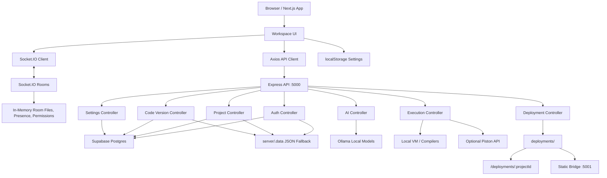

<div align="center">
  

  # CodeVerse

  **A real-time collaborative IDE for coding, running, visualizing algorithms, and publishing static workspaces from one focused browser studio.**

  <p>
    <a href="https://codeverse-rho.vercel.app"><strong>Live Demo</strong></a>
    ·
    <a href="#-quick-start"><strong>Quick Start</strong></a>
    ·
    <a href="#-features"><strong>Features</strong></a>
    ·
    <a href="#-architecture"><strong>Architecture</strong></a>
    ·
    <a href="#-api--usage-examples"><strong>API</strong></a>
  </p>

  <p>
    <a href="#-quick-start"></a>
    <a href="./LICENSE.txt"></a>
    <a href="./client/package.json"></a>
    <a href="./server/package.json"></a>
    <a href="https://github.com/Ayush-Kumar0207/codeverse/stargazers"></a>
  </p>

  <p>
    <a href="https://codeverse-rho.vercel.app"></a>
    <a href="https://codeverse-rho.vercel.app"></a>
    
    <a href="https://github.com/Ayush-Kumar0207/codeverse/pulls"></a>
  </p>
</div>

<p align="center">
  
</p>

---

## 🔴 Live Demo & Status

| Surface | URL / Status |
| --- | --- |
| Production app | [https://codeverse-rho.vercel.app](https://codeverse-rho.vercel.app) |
| Production frontend provider | Vercel |
| Production API | Configure with `NEXT_PUBLIC_API_BASE_URL`; no public backend URL is committed in this repository |
| Local frontend | `http://localhost:3000` |
| Local API | `http://localhost:5000` |
| Local health check | `GET http://localhost:5000/api/health` |
| Workspace deployment route | `http://localhost:5000/deployments/:projectId/` |
| Static bridge listener | `http://localhost:5001/:projectId/` |
| Staging | No staging URL is currently committed |

> CodeVerse can run locally without cloud credentials for the core IDE flow. Supabase, OAuth, Ollama, and remote execution are optional integrations that unlock persistence, sign-in providers, AI help, and Piston-backed execution.

---

## 📸 Preview

<!-- Replace these generated placeholders with committed screenshots in docs/screenshots/ when product captures are available. -->

| Workspace | Collaboration | Algorithm Trace |
| --- | --- | --- |
|  |  |  |

**CLI/API preview**

```bash
curl -s -X POST http://localhost:5000/api/execute \
  -H "Content-Type: application/json" \
  -d '{"code":"console.log(\"Hello from CodeVerse\")","language":"javascript","roomId":"demo","user":"local"}'
```

---

## ⚡ Quick Start

### Requirements

- Node.js 20 LTS or newer
- npm 10 or newer
- Optional: Supabase project for cloud persistence
- Optional: Python, GCC/G++, and JDK for local code execution
- Optional: Ollama for the local AI assistant

### Run locally

```bash
git clone https://github.com/Ayush-Kumar0207/codeverse.git
cd codeverse

# Terminal 1: API, Socket.IO server, and deployment server
cd server
npm ci
npm run dev
```

```bash
# Terminal 2: Next.js app
cd client
npm ci
npm run dev
```

Open `http://localhost:3000`.

The backend starts on `http://localhost:5000`, and the static deployment bridge starts on `http://localhost:5001`. If Supabase is not configured, development auth, projects, and code versions fall back to JSON files in `server/.data/`.

---

## 📖 Table Of Contents

- [About The Project](#-about-the-project)
- [Features](#-features)
- [Tech Stack](#-tech-stack)
- [Architecture](#-architecture)
- [Project Structure](#-project-structure)
- [Environment Variables](#-environment-variables)
- [API & Usage Examples](#-api--usage-examples)
- [Deployment](#-deployment)
- [Performance & Benchmarks](#-performance--benchmarks)
- [Security](#-security)
- [Roadmap](#-roadmap)
- [Contributing](#-contributing)
- [FAQ](#-faq)
- [License](#-license)
- [Author & Credits](#-author--credits)

---

## 🧠 About The Project

CodeVerse is built for developers, students, and interview-prep teams who want a browser IDE that feels collaborative from the first keystroke. It combines a Monaco-powered editor, Socket.IO rooms, live team chat, organizer permissions, local or remote code execution, AI guidance, algorithm visualization, version history, and instant static publishing.

The project solves a familiar problem: coding platforms often split the workflow across an editor, terminal, chat app, deployment tool, AI assistant, and learning reference. CodeVerse pulls those pieces into one focused workspace so a team can write code, explain it, run it, visualize it, restore previous states, and publish a browser-ready result without context switching.

What makes it different:

- **Multiplayer-first IDE**: rooms, file sync, presence, cursor motion, chat, and organizer controls are first-class.
- **Learning-native workflow**: the algorithm encyclopedia and AlgoTrace visualizer turn code into inspectable state transitions.
- **Practical local development**: core auth/projects/history degrade to local JSON stores when Supabase is unavailable.
- **Publish from the editor**: static workspaces can be sanitized, written to `deployments/`, and served instantly.
- **Local AI by default**: the assistant targets Ollama first, with prompt compaction and streaming support.

---

## ✨ Features

### Workspace & Editor

- Monaco Editor integration with custom CodeVerse themes.
- Multi-file workspaces with starter files for JavaScript, TypeScript, Python, C, C++, Java, HTML, CSS, Markdown, JSON, and plaintext.
- File creation, deletion, language detection, and active-file scoped editing.
- HTML/CSS/JavaScript preview composition directly from workspace files.
- Markdown rendering with GitHub-flavored Markdown support.
- Resizable panels for explorer, editor, terminal/output/history, assistant, team, and trace views.
- Command palette, settings modal, navigation surfaces, and public/private app flows.

### Real-Time Collaboration

- Socket.IO workspace rooms keyed by project/editor ID.
- Live code changes and full file-map synchronization.
- Team chat and AI chat modes.
- Presence roster with roles, statuses, edit access, and join/leave events.
- Cursor movement broadcasts for collaborative editing context.
- Organizer-only controls for toggling collaborator edit access and removing collaborators.
- Realtime ping/pong hooks for latency diagnostics.

### Execution & Output

- Local JavaScript execution through a constrained Node VM context.
- Local Python execution through `python -c`.
- Local C and C++ compile/run flow through `gcc` and `g++`.
- Local Java compile/run flow through `javac` and `java`.
- Visual output mode for HTML, CSS, and Markdown.
- Optional remote execution through the Piston API.
- Execution start/result/error events broadcast into the active workspace room.
- Timeout and spawn-permission handling with user-readable errors.

### AI Pair Programming

- Ollama-backed assistant with `qwen2.5-coder:1.5b` as the default model.
- Streaming and non-streaming suggestion endpoints.
- Local fast-path responses for simple conversational prompts.
- Prompt and context compaction to keep latency predictable.
- Model fallback list for local Ollama deployments.
- Workspace-aware assistant context built from project name, active file, language, file list, and active code snippet.

### Versioning & Recovery

- Save code versions to Supabase or local JSON fallback.
- Compare saved versions with a Monaco diff viewer.
- Restore a saved version into the active file.
- Workspace timeline snapshots for organizer-controlled state recovery.
- Step backward, step forward, restore by timestamp, and return to latest workspace state.
- Settings cloud sync with snapshot history and rollback support.

### Static Publishing

- Publish a workspace file map through `POST /api/deploy`.
- Sanitized project IDs and file paths to prevent path traversal.
- Static assets are written to `deployments/<projectId>/`.
- Existing `index.html` files are served as-is.
- If no `index.html` exists, CodeVerse generates a polished index from `README.md`, `PROBLEM.md`, source files, and runnable JavaScript where possible.
- Deployed projects are served from both the primary API route and secondary static bridge.

### Algorithm Learning

- Algorithm encyclopedia with searchable topics, approaches, complexity notes, edge cases, and multi-language implementations.
- Demo editor payloads seeded from encyclopedia entries.
- AlgoTrace visualizer for arrays, matrices, graphs, trees, linked lists, heaps, stacks, queues, recursion frames, bit states, pointers, windows, registers, and raw trace fields.
- Beginner-focused step explanations, invariants, decisions, and implementation focus.
- "Ask AI" handoff from trace narratives into the assistant panel.

### Settings & Diagnostics

- Theme profiles: midnight, hacker, solarized, and amoled.
- UI scale, animation, glow, reduced-motion, autocomplete, tab-size, and audio profile settings.
- Local settings persistence through `localStorage`.
- Cloud settings history through Supabase `setting_snapshots`.
- APM tracking, latency checks, memory/load diagnostics, stress mode, and heartbeat against `/api/health`.

---

## 🏗 Tech Stack

| Layer | Technologies |
| --- | --- |
| Frontend | Next.js 15 App Router, React 19, TypeScript, Tailwind CSS, shadcn-style components, Radix UI, Base UI |
| Editor | Monaco Editor, Monaco diff views, custom themes, language detection |
| UI Motion | Framer Motion, Lucide React, react-resizable-panels, xterm |
| Markdown & Docs | react-markdown, remark-gfm, github-markdown-css |
| Backend | Node.js, Express 5, Socket.IO, JWT, Passport session compatibility |
| Auth | bcrypt password hashing, JWT bearer auth, GitHub OAuth, Google OAuth |
| Data | Supabase Postgres, local JSON fallback stores, SQL schema in `server/schema.sql` |
| AI | Ollama local generation, streaming responses, optional Gemini maintenance script |
| Execution | Node VM, child process runtimes, GCC/G++, Java, Python, optional Piston API |
| Deployment | Vercel frontend, Node/Express backend, local static workspace publisher |
| Tooling | npm, ESLint, Prettier, TypeScript, Tailwind, ts-morph |

---

## 🏛 Architecture



**Request flow**

1. The Next.js app calls the Express API through `NEXT_PUBLIC_API_BASE_URL`, defaulting to `http://localhost:5000` during local development.
2. Realtime collaboration uses Socket.IO rooms. The server tracks active users, current room files, edit permissions, and room-local events in memory.
3. Supabase stores users, projects, files, versions, and settings snapshots. If Supabase is unavailable, auth/projects/code versions use local JSON stores for development.
4. Execution is routed to local language runtimes by default. `EXECUTION_STRATEGY=remote` enables the Piston path where a runtime mapping exists.
5. Deployments write sanitized workspace files into `deployments/` and serve them from the API and static bridge.

---

## 📂 Project Structure

```text
CodeVerse/
├── client/
│   ├── app/                    # Next.js App Router pages and layouts
│   ├── components/             # IDE panels, editor, modals, UI primitives, visualizers
│   ├── context/                # Auth and settings providers
│   ├── data/algos/             # Algorithm encyclopedia entries and generated content
│   ├── hooks/                  # Editor, socket, execution, AI, settings, preview hooks
│   ├── lib/                    # Utility helpers and algorithm learning builders
│   ├── services/               # API clients for auth, projects, execution, deploy, AI
│   ├── public/                 # Static Next.js assets
│   └── package.json
├── server/
│   ├── index.js                # API server, Socket.IO server, static deployment bridge
│   ├── schema.sql              # Supabase/Postgres schema
│   ├── scripts/                # Cloud sync setup and maintenance scripts
│   ├── src/
│   │   ├── app.js              # Express app factory and route registration
│   │   ├── config/             # Env, Supabase, Passport compatibility
│   │   ├── controllers/        # HTTP request handlers
│   │   ├── executors/          # Runtime-specific execution helpers
│   │   ├── middlewares/        # Auth, async, and error middleware
│   │   ├── routes/             # API route modules
│   │   ├── services/           # Auth, projects, AI, execution, deploy, settings
│   │   ├── sockets/            # Socket.IO collaboration server
│   │   └── utils/              # JWT, errors, language runtime helpers
│   ├── temp/                   # Runtime artifacts from local execution
│   └── package.json
├── shared/
│   ├── constants/              # Shared language and socket-event contracts
│   └── types/                  # Shared TypeScript declaration files
├── deployments/                # Published static workspaces
├── scripts/                    # Repository-level maintenance scripts
├── LICENSE.txt
└── README.md
```

---

## ⚙️ Environment Variables

CodeVerse runs locally without environment variables for the core flow, but production and cloud features should be configured explicitly.

### Backend: `server/.env`

```bash
# Server
PORT=5000
DEPLOY_PORT=5001
CLIENT_URL=http://localhost:3000
FRONTEND_URL=http://localhost:3000
NEXT_PUBLIC_FRONTEND_URL=http://localhost:3000
API_BASE_URL=http://localhost:5000

# Security
SESSION_SECRET=replace-with-a-long-random-session-secret
JWT_SECRET=replace-with-a-long-random-jwt-secret

# Supabase persistence
SUPABASE_URL=
SUPABASE_ANON_KEY=
SUPABASE_TIMEOUT_MS=2500

# OAuth providers
GITHUB_CLIENT_ID=
GITHUB_CLIENT_SECRET=
GITHUB_CALLBACK_URL=http://localhost:5000/api/auth/github/callback
GOOGLE_CLIENT_ID=
GOOGLE_CLIENT_SECRET=
GOOGLE_CALLBACK_URL=http://localhost:5000/api/auth/google/callback

# Execution
EXECUTION_STRATEGY=local
PISTON_URL=https://emkc.org/api/v2/piston/execute
PISTON_API_KEY=

# Local AI
OLLAMA_URL=http://localhost:11434
OLLAMA_MODEL=qwen2.5-coder:1.5b
OLLAMA_NUM_PREDICT=180
OLLAMA_NUM_CTX=2048
OLLAMA_KEEP_ALIVE=20m
AI_MAX_PROMPT_CHARS=2200
AI_MAX_CONTEXT_CHARS=1800

# Maintenance script only: server/scripts/auto_overhaul_gemini.js
GEMINI_API_KEY=
```

### Frontend: `client/.env.local`

```bash
NEXT_PUBLIC_API_BASE_URL=http://localhost:5000
```

### Variable guide

| Variable | Required | Purpose |
| --- | --- | --- |
| `PORT` | No | Primary Express API and Socket.IO port. Defaults to `5000`. |
| `DEPLOY_PORT` | No | Secondary static deployment bridge. Defaults to `5001`. |
| `CLIENT_URL`, `FRONTEND_URL`, `NEXT_PUBLIC_FRONTEND_URL` | Production | Allowed frontend origins and OAuth redirects. |
| `NEXT_PUBLIC_API_BASE_URL` | Production frontend | Public backend URL used by the Next.js client. |
| `SESSION_SECRET` | Production | Express session secret used during OAuth state flow. |
| `JWT_SECRET` | Production | JWT signing secret for bearer auth. |
| `SUPABASE_URL`, `SUPABASE_ANON_KEY` | Recommended | Enables persistent users, projects, versions, and settings snapshots. |
| `GITHUB_*`, `GOOGLE_*` | Optional | Enables OAuth login buttons. |
| `EXECUTION_STRATEGY` | No | `local` for local runtimes, `remote` for Piston where supported. |
| `PISTON_URL`, `PISTON_API_KEY` | Optional | Remote execution endpoint and optional key. |
| `OLLAMA_*`, `AI_MAX_*` | Optional | Local AI assistant model, generation budget, context caps, and keep-alive settings. |

---

## 🧪 API & Usage Examples

### Health

```bash
curl http://localhost:5000/api/health
```

### Register and login

```bash
curl -s -X POST http://localhost:5000/api/auth/register \
  -H "Content-Type: application/json" \
  -d '{"username":"ada","email":"ada@example.com","password":"secret123"}'

curl -s -X POST http://localhost:5000/api/auth/login \
  -H "Content-Type: application/json" \
  -d '{"username":"ada","password":"secret123"}'
```

### Create a project

```bash
curl -s -X POST http://localhost:5000/api/projects/create \
  -H "Content-Type: application/json" \
  -d '{"title":"Launchpad","language":"html","owner":"ada"}'
```

### Execute code

```bash
curl -s -X POST http://localhost:5000/api/execute \
  -H "Content-Type: application/json" \
  -d '{"code":"print(\"Hello from Python\")","language":"python","roomId":"launchpad","user":"ada","fileName":"main.py"}'
```

### Save and load versions

```bash
curl -s -X POST http://localhost:5000/api/code/save \
  -H "Content-Type: application/json" \
  -d '{"userId":"local-user-id","fileName":"main.py","code":"print(\"snapshot\")"}'

curl -s "http://localhost:5000/api/code/versions?userId=local-user-id&fileName=main.py"
```

### Ask the AI assistant

```bash
curl -s -X POST http://localhost:5000/api/ai/suggest \
  -H "Content-Type: application/json" \
  -d '{"prompt":"Explain this function in three steps.","context":"function add(a,b){ return a + b }","fast":true}'
```

### Deploy a static workspace

```bash
curl -s -X POST http://localhost:5000/api/deploy \
  -H "Content-Type: application/json" \
  -d '{
    "projectId": "hello-codeverse",
    "files": {
      "index.html": "<!doctype html><html><body><h1>Hello CodeVerse</h1></body></html>",
      "README.md": "# Hello CodeVerse"
    }
  }'
```

The response includes a URL similar to:

```text
http://localhost:5000/deployments/hello-codeverse/
```

### Socket.IO event contract

| Event | Direction | Purpose |
| --- | --- | --- |
| `joinRoom` | client to server | Join a workspace room with optional user presence. |
| `codeChange` | both | Sync active-file code changes. |
| `filesChange` | both | Sync the complete file map and active file. |
| `syncCode` | server to client | Send the current room file state to a joining client. |
| `chatMessage` | both | Send team or workspace messages. |
| `cursorMove` | both | Broadcast editor cursor position. |
| `presenceUpdate` | both | Update collaborator status. |
| `editPermission:update` | client to server | Organizer updates edit access. |
| `editPermission:state` | server to client | Broadcast current edit access. |
| `collaborator:remove` | client to server | Organizer removes a collaborator. |
| `execution:start/result/error` | both | Coordinate execution status across a room. |
| `realtime:ping/pong` | both | Measure realtime latency. |

---

## 🚀 Deployment

### Frontend on Vercel

1. Create a Vercel project with `client/` as the root directory.
2. Set `NEXT_PUBLIC_API_BASE_URL` to the deployed backend URL.
3. Use the default Next.js build command:

```bash
npm ci
npm run build
```

### Backend on a Node host

Use Render, Railway, Fly.io, a VPS, or any host that supports long-running Node processes and WebSockets.

```bash
cd server
npm ci
node index.js
```

Production checklist:

- Set `PORT`, `DEPLOY_PORT`, `CLIENT_URL`, `FRONTEND_URL`, and `NEXT_PUBLIC_FRONTEND_URL`.
- Set strong `SESSION_SECRET` and `JWT_SECRET` values.
- Configure Supabase credentials and run `server/schema.sql` in the Supabase SQL editor.
- Configure OAuth callback URLs if GitHub or Google sign-in is enabled.
- Keep the backend reachable from the Vercel frontend through `NEXT_PUBLIC_API_BASE_URL`.
- Use HTTPS in production.
- Run untrusted code only inside a hardened sandbox or remote execution service.

### Static workspace deployment

The deployment service is built into the backend:

- `POST /api/deploy` accepts `{ projectId, files }`.
- File names and project IDs are sanitized before writing.
- Files are written to `deployments/<projectId>/`.
- The API serves them from `/deployments/:projectId/`.
- The secondary bridge serves them from `http://localhost:5001/:projectId/`.

### CI/CD

No GitHub Actions workflow is currently committed. A strong first pipeline would run:

```bash
cd client
npm ci
npm run build

cd ../server
npm ci
node -e "require('./src/app')"
```

---

## 📊 Performance & Benchmarks

No reproducible benchmark suite is committed yet. The codebase does include practical runtime safeguards and diagnostics:

| Area | Current behavior |
| --- | --- |
| Backend health | `/api/health` reports uptime, memory, timestamp, and load average. |
| Local execution | Local runtime processes use a 10 second timeout. |
| Remote execution | Piston calls use a 15 second timeout. |
| Supabase calls | Project operations race against `SUPABASE_TIMEOUT_MS`, default `2500ms`. |
| AI prompt size | Prompts and context are compacted with configurable max-character caps. |
| Settings diagnostics | Client heartbeat checks health every 2 seconds and tracks latency, memory, load, and APM. |
| Workspace timeline | Organizer snapshots are capped at 80 states in memory. |
| Settings snapshots | Cloud settings history is pruned to the latest 20 snapshots per user. |

Recommended future benchmark targets:

- Socket.IO edit propagation latency across 2, 10, and 50 clients.
- Cold and warm AI response latency per Ollama model.
- Deployment time for 10, 100, and 1,000 file workspaces.
- Execution latency per language and strategy.

---

## 🔒 Security

CodeVerse includes several important protections:

- Passwords are hashed with `bcrypt`.
- API sessions use JWT bearer tokens.
- OAuth flows use state validation and provider-specific callbacks.
- CORS is restricted to localhost, configured frontend URLs, and Vercel preview domains.
- Deployment file paths are sanitized and checked to prevent writes outside the deployment directory.
- Project deployment slugs are normalized and length-limited.
- Local execution has timeouts and readable permission-error handling.
- Supabase settings sync includes a companion RLS setup script in `server/scripts/cloud_sync_setup.sql`.

Security notes for production:

- Replace fallback secrets before deployment. Never use the default `SESSION_SECRET` or `JWT_SECRET`.
- Treat local code execution as trusted-user functionality. The Node VM and local compiler paths are not a complete sandbox for hostile code.
- Prefer remote, containerized, or otherwise isolated execution for public multi-tenant deployments.
- Do not expose Supabase service-role credentials to the frontend.
- Restrict OAuth callback URLs to known frontend/backend domains.
- Add rate limiting before opening execution, AI, and deploy endpoints to the public internet.

---

## 🗺 Roadmap

- [x] Next.js App Router frontend with premium IDE layout.
- [x] Express API with Socket.IO collaboration rooms.
- [x] Supabase schema plus local JSON fallback for development.
- [x] Monaco editor, multi-file state, language starters, and visual preview.
- [x] Team chat, presence, edit permissions, and collaborator removal.
- [x] Local and optional remote code execution.
- [x] Ollama-backed assistant with streaming.
- [x] Version history, diff compare, and workspace timeline restore.
- [x] Static workspace publishing.
- [x] Algorithm encyclopedia and AlgoTrace visualizer.
- [ ] Add committed screenshots and a short product demo GIF.
- [ ] Add GitHub Actions for install, lint, typecheck, and build.
- [ ] Add Dockerfile and docker-compose for one-command local infrastructure.
- [ ] Harden execution through container isolation for public deployments.
- [ ] Persist collaboration permissions and room state beyond process memory.
- [ ] Add a public status page and production API uptime badge.
- [ ] Add E2E tests for auth, editor sync, execution, and deployment.

---

## 🤝 Contributing

Contributions are welcome. Keep changes focused, documented, and easy to review.

1. Fork the repository.
2. Create a feature branch:

```bash
git checkout -b feature/your-feature-name
```

3. Install dependencies and run the relevant checks:

```bash
cd client
npm ci
npm run build

cd ../server
npm ci
node -e "require('./src/app')"
```

4. Use clear commit messages:

```bash
git commit -m "feat: add workspace invite controls"
```

5. Open a pull request with:

- What changed.
- Why it changed.
- Screenshots or recordings for UI changes.
- Any new environment variables or migration steps.
- Manual test notes for realtime, execution, or deployment behavior.

---

## ❓ FAQ

**Can I run CodeVerse without Supabase?**  
Yes for local development. Auth, projects, and code versions fall back to `server/.data/`. Supabase is recommended for durable cloud persistence and required for cloud settings history.

**Why does OAuth say it is not configured?**  
The backend needs provider credentials, callback URLs, and frontend origin variables. The frontend also needs `NEXT_PUBLIC_API_BASE_URL` when deployed.

**Which languages can run today?**  
JavaScript, Python, C, C++, and Java have local execution paths. HTML, CSS, and Markdown use visual output. Remote execution can be enabled with Piston for supported runtime mappings.

**Does the AI assistant require OpenAI?**  
No. The implemented assistant targets Ollama locally. The `openai` package exists in dependencies, but the active AI service uses Ollama endpoints.

**Where do deployments live?**  
Published static projects are written to `deployments/<projectId>/` and served by the backend.

**Is local execution safe for untrusted public users?**  
No. Use isolated infrastructure or a remote execution provider before exposing code execution to untrusted users.

**Why is there no production API URL in the README?**  
The repo contains the production frontend URL and localhost backend defaults, but no committed public backend URL. Set `NEXT_PUBLIC_API_BASE_URL` for your deployed frontend.

---

## 📜 License

Distributed under the MIT License. See [LICENSE.txt](./LICENSE.txt) for details.

---

## 👨‍💻 Author & Credits

**Ayush Kumar**  
GitHub: [@Ayush-Kumar0207](https://github.com/Ayush-Kumar0207)

Built with excellent open-source tools including Next.js, React, Monaco Editor, Socket.IO, Supabase, Tailwind CSS, Framer Motion, Lucide, Ollama, and Piston.

---

## 🌟 Support

If CodeVerse helps you build, learn, teach, or collaborate, star the repository and share feedback through issues or pull requests.

<div align="center">
  <a href="https://github.com/Ayush-Kumar0207/codeverse">
    
  </a>
</div>
