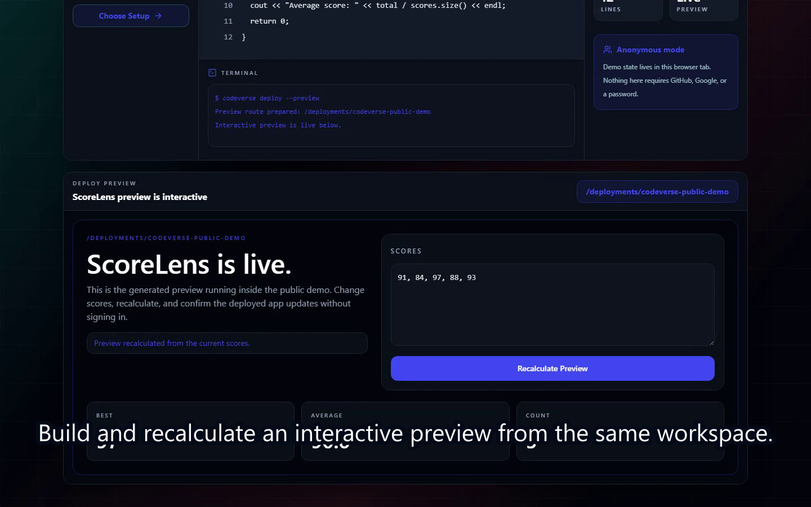
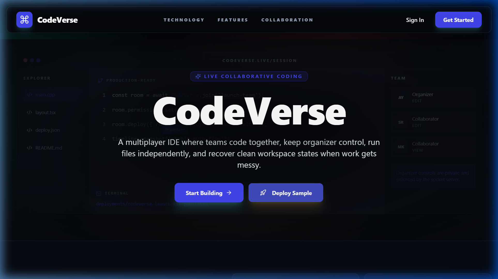
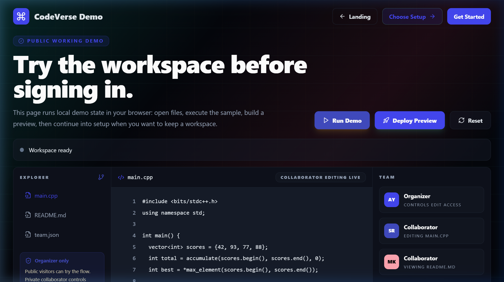
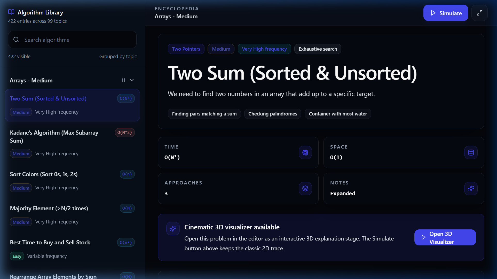
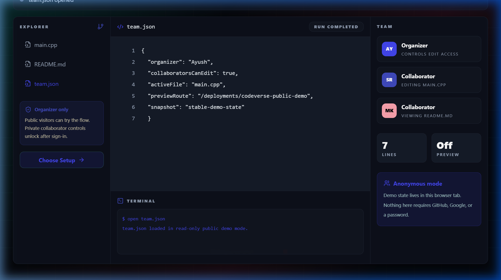
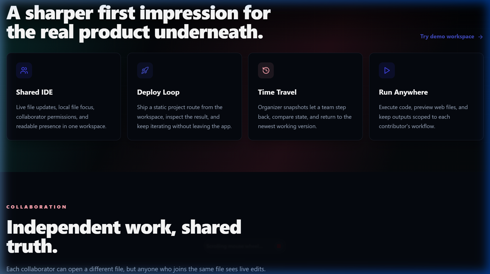
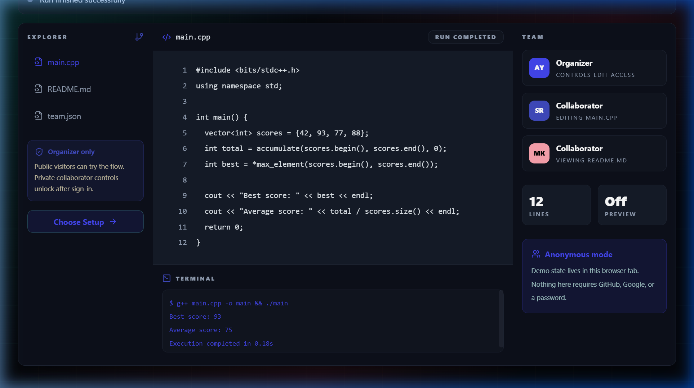
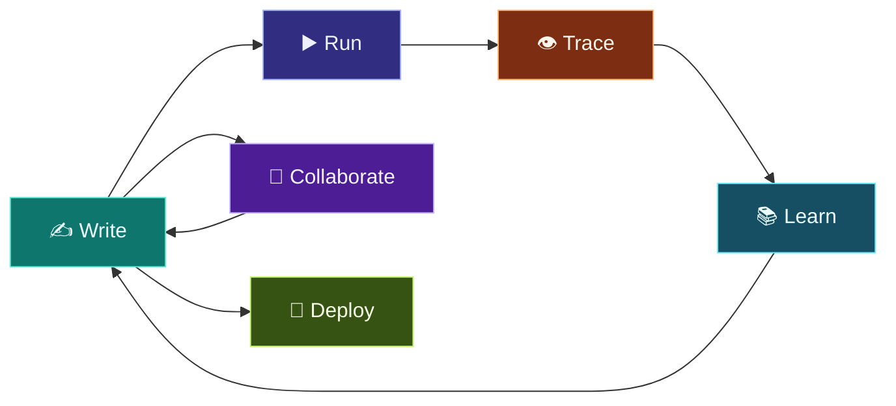
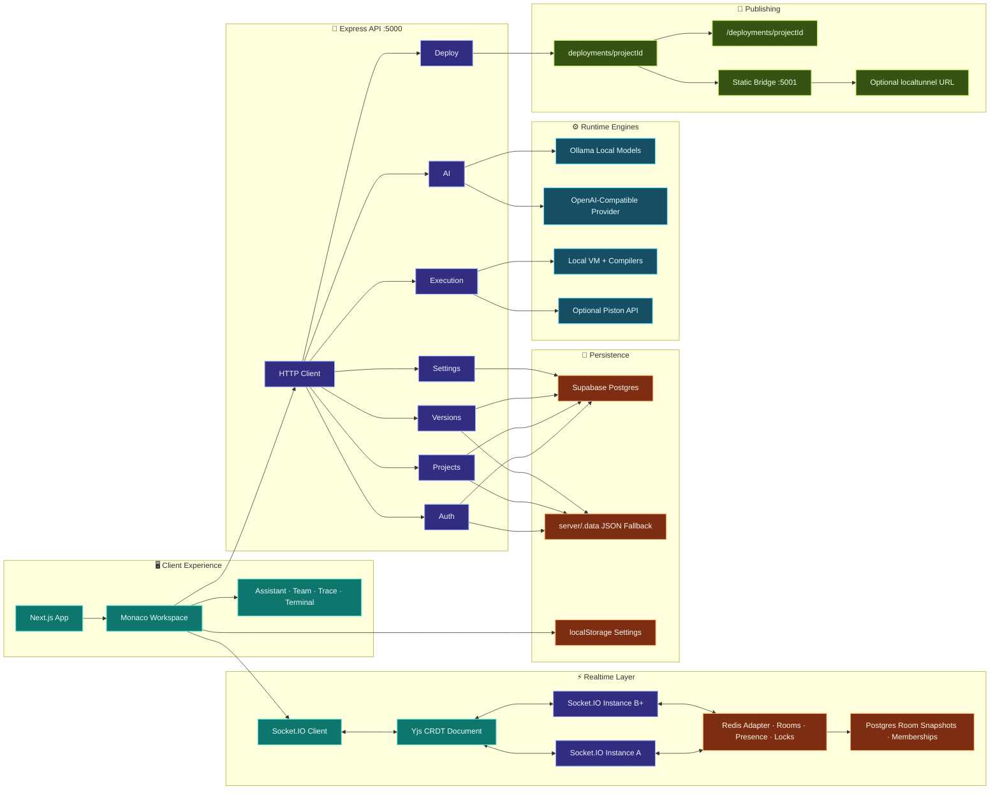
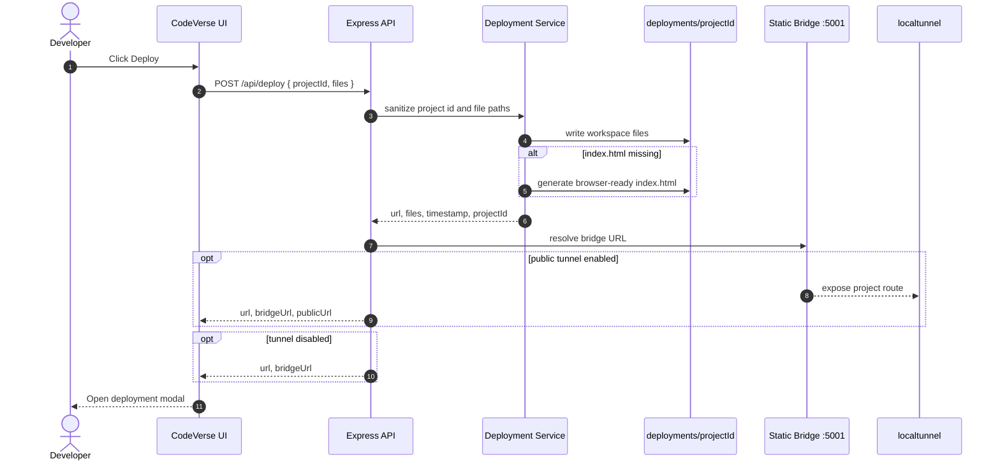

<div align="center">

  # ⚡ CodeVerse

  ### Build together. Prove what changed.

  **An open-source collaborative browser IDE where live code, execution, review, and replayable engineering evidence stay in one workspace.**

  <p>
    <a href="https://codeverse-rho.vercel.app"></a>
    <a href="https://codeverse-rho.vercel.app/demo"></a>
    <a href="https://github.com/Ayush-Kumar0207/codeverse/labels/good%20first%20issue"></a>
  </p>

  <p>
    <a href="https://codeverse-rho.vercel.app"></a>
    <a href="https://github.com/Ayush-Kumar0207/codeverse/actions/workflows/ci.yml"></a>
    <a href="https://github.com/Ayush-Kumar0207/codeverse/actions/workflows/production-smoke.yml"></a>
    <a href="https://github.com/Ayush-Kumar0207/codeverse/actions/workflows/codeql.yml"></a>
    <a href="./LICENSE.txt"></a>
    
    
    
    
    
    
    
    
    
    
    <a href="https://github.com/Ayush-Kumar0207/codeverse/pulls"></a>
  </p>

  <p>
    <a href="#start-here">Start here</a> •
    <a href="#-the-problem-why-codeverse-exists">Why CodeVerse</a> •
    <a href="#-quick-start">Run locally</a> •
    <a href="CONTRIBUTING.md">Contribute</a> •
    <a href="docs/ROADMAP.md">Roadmap</a>
  </p>

</div>

---

## Watch CodeVerse in 76 seconds

<p align="center">
  <a href="https://codeverse-rho.vercel.app/media/codeverse-demo.mp4">
    
  </a>
</p>

<p align="center">
  <strong>Run an anonymous workspace, inspect a live preview, and trace the resulting engineering evidence.</strong><br />
  <a href="https://codeverse-rho.vercel.app/media/codeverse-demo.mp4">Play the product tour</a> · <a href="https://codeverse-rho.vercel.app/demo">Try the same journey</a>
</p>

The tour is captured from the real local application with a maintained Playwright journey. Its raw recording, captions, MP4 packaging, poster generation, privacy checks, and duration gate are reproducible with `npm run demo:build`; see [`docs/demo/README.md`](docs/demo/README.md).

---

## Read the distributed collaboration deep dive

**[What it took to move a collaborative browser IDE beyond process memory](https://dev.to/thesablefalcon/what-it-took-to-move-a-collaborative-browser-ide-beyond-process-memory-3cj8)** explains why CodeVerse separates Yjs document convergence, Redis-backed live state and fan-out, server-side permissions, reconnect identity, and durable Supabase snapshots.

The article publishes the measured 100/500-client method and its limitations instead of presenting a local loopback benchmark as hosted capacity. Review the [reproducible benchmark report](docs/COLLABORATION_BENCHMARKS.md) or choose a focused issue from the [v1.1 community reliability milestone](https://github.com/Ayush-Kumar0207/codeverse/milestone/1).

---

## 🔴 Live Demo & Status

<p align="center">
  <a href="https://codeverse-rho.vercel.app">
    
  </a>
</p>

| Surface | URL / Status |
| --- | --- |
| **Production App** | [codeverse-rho.vercel.app](https://codeverse-rho.vercel.app) |
| **Public Status** | [codeverse-rho.vercel.app/status](https://codeverse-rho.vercel.app/status) · live API, database, collaboration, and SLO telemetry |
| **Frontend Host** | Vercel |
| **Backend API** | [codeverse-5422.onrender.com](https://codeverse-5422.onrender.com) · configure via `NEXT_PUBLIC_API_BASE_URL` |
| **Local Frontend** | `http://localhost:3000` |
| **Local API** | `http://localhost:5000` |
| **Health Checks** | `GET /api/health` · `GET /api/status` |
| **Deployment Bridge** | `http://localhost:5001/:projectId/` |
| **Public Tunnel** | Optional localtunnel URL when `DEPLOY_TUNNEL_ENABLED=true` |

> **Zero-config local development.** CodeVerse runs locally without cloud credentials for the core IDE flow. Supabase, OAuth, Ollama, and remote execution are optional integrations that unlock persistence, sign-in providers, AI help, and sandboxed execution.

---

<a id="start-here"></a>

## Start here

You do not need to understand every subsystem before using or contributing to CodeVerse.

| I want to… | Best next step |
| --- | --- |
| See the product without an account | [Open the demo workspace](https://codeverse-rho.vercel.app/demo) |
| Build something in the hosted workspace | [Launch CodeVerse](https://codeverse-rho.vercel.app) |
| Understand the engineering | Read the [architecture](#-architecture) and [collaboration benchmarks](docs/COLLABORATION_BENCHMARKS.md) |
| Make a small contribution | Choose a [`good first issue`](https://github.com/Ayush-Kumar0207/codeverse/labels/good%20first%20issue) and follow [CONTRIBUTING.md](CONTRIBUTING.md) |
| Ask a design or setup question | Start a [GitHub Discussion](https://github.com/Ayush-Kumar0207/codeverse/discussions) |
| Check whether production is healthy | Open the [public status page](https://codeverse-rho.vercel.app/status) |

### Why it is different

| Typical browser IDE | CodeVerse |
| --- | --- |
| Synchronizes editor text | CRDT editing, awareness cursors, roles, reconnect recovery, and Redis-backed multi-instance rooms |
| Shows the latest output | Connects work to replay, tests, runtime events, review, deployment, and recovery evidence |
| Adds an opaque AI badge | Separates unverified previews from server-executed, digest-bound verification |
| Treats the demo as proof of scale | Publishes production contracts, measured 100/500-client baselines, and their limitations |

The project is under a **feature freeze**. Current work is intentionally centered on reliability, accessibility, security, documentation, performance, and real contributor feedback—not a longer feature list. See the [public roadmap](docs/ROADMAP.md) and [adoption scorecard](docs/ADOPTION.md).

---

## 🛡 CodeVerse EvidenceOS

EvidenceOS turns the existing multiplayer IDE into a proof-carrying engineering environment. Its features share one tamper-evident project ledger instead of storing disconnected UI state:

- **Semantic Evidence Graph** uses typed causal relations such as `implements`, `caused-fix`, `verified-by`, `reviewed-by`, `deployed-as`, `calls`, `writes-to`, `traced-by`, and `attested-by`.
- **Deterministic Session Replay** reconstructs files, active file, cursor, terminal commands and output digests, debugger variables and breakpoints, network calls, database mutations, traces, branches, runtime versions, dependency versions, sealed environment values, and lockfile identity. The server—not the caller—re-executes the sealed command. Production uses an allow-listed, digest-pinned container with no network, a read-only filesystem, dropped capabilities, and CPU, memory, and process limits.
- **Artifact-bound Proof Packages** hash the exact uploaded workspace and require independently digest-bound source, test, runtime, security, compatibility, performance, migration, deployment, rollback, and understanding attestations. Oversized workspaces are rejected for cloud proof instead of being silently truncated.
- **Adversarial Review Board** executes seven isolated worker processes (digest-pinned containers in production) over the same patch digest. Its general autonomous Builder can return a complete challenge-driven workspace for arbitrary correctness, concurrency, security, test, performance, and architecture repairs; every proposal is validated, revised in isolation, and independently re-analyzed, with an auditable deterministic fallback when AI is disabled or unavailable.
- **Hands-on Understanding Verification** evaluates compiler-derived purpose and data flow, exact hidden boundary predictions, a complete replacement that must compile and preserve valid behavior, and hidden debugging probes, plus transfer and behavioral continuity signals. JavaScript/TypeScript uses the compiler API; Python, Java, C, C++, Go, and Rust use language-native Tree-sitter ASTs and hidden executable harnesses in the same sealed runtime contract.
- **Assessment Scorecard** reports correctness, process, debugging, test quality, comprehension, security awareness, AI dependence, and evidence integrity.
- **Engineering Digital Twin** uses compiler ASTs for JavaScript/TypeScript plus Tree-sitter ASTs for Python, Java, C, C++, Go, and Rust, resolved cross-file imports/calls, SQL/HTML parsers, test coverage, network/database telemetry, and OpenTelemetry span identity to build API, data, queue, provider, test, migration, and deployment relationships and a four-hop blast-radius analysis.
- **Engineering Arena** supplies eight incident classes, hidden fault injection, locked starter environments, consent and privacy modes, AI-use policies, solo runs, team lobbies, code joining, quick matchmaking, timers, evaluator templates with private executable acceptance suites, process-evidence rubrics, mandatory independent HMAC-signed reports, and leaderboards. Each built-in scenario has multiple weighted hidden tests, adversarial boundaries, repeated concurrency/performance trials, p95 timing evidence, and partial-credit scoring; final correctness comes only from the server-run hidden suite.

Every recorded event includes its predecessor hash and a SHA-256 integrity hash. Proof packages and Arena reports require separate signing keys, issuers, and key identities; missing or placeholder signing configuration fails closed. Browser-only operation is explicitly labeled an **unverified preview** and cannot verify a proof or grade an Arena submission. Cloud workspaces persist events, reviews, proof packages, verifications, arena sessions, and organization scenario templates in PostgreSQL/Supabase. Local server development falls back to the ignored `server/.data/evidence.json` and `server/.data/arenas.json` stores.

### EvidenceOS API

| Method | Route | Purpose |
| --- | --- | --- |
| `GET` | `/api/evidence/:projectId` | Reconstruct the evidence graph and assessment scorecard |
| `POST` | `/api/evidence/:projectId/events` | Append a sealed engineering event |
| `POST` | `/api/evidence/:projectId/packages` | Create and sign an exact-artifact proof package |
| `GET` | `/api/evidence/:projectId/packages/:packageId/verify` | Recompute package signature and attestation coverage |
| `GET` | `/api/evidence/:projectId/export?privacy=redacted` | Export a digest-addressed full or redacted evidence report |
| `POST` | `/api/evidence/:projectId/reviews` | Run seven isolated roles through challenge, revision, and consensus |
| `POST` | `/api/evidence/:projectId/challenges` | Generate a digest-bound hands-on understanding challenge |
| `POST` | `/api/evidence/:projectId/verifications` | Score and persist behavioral understanding evidence |
| `POST` | `/api/evidence/:projectId/twin` | Build the static-plus-runtime digital twin and impact prediction |
| `POST` | `/api/evidence/:projectId/replays/:sessionId/verify` | Verify a deterministic replay execution |
| `GET/POST` | `/api/evidence/arena/scenarios` | List built-ins or create an evaluator scenario template |
| `GET` | `/api/evidence/arena/leaderboard` | Return evidence-integrity-aware arena rankings |
| `GET/POST` | `/api/evidence/:projectId/arena/sessions` | List or start timed/lobby assessment sessions |
| `POST` | `/api/evidence/:projectId/arena/lobbies/join` | Join a shared team lobby by code |
| `POST` | `/api/evidence/:projectId/arena/matchmake` | Join a compatible team or create a waiting lobby |
| `POST` | `/api/evidence/:projectId/arena/sessions/:sessionId/begin` | Start a lobby timer and evidence window |
| `POST` | `/api/evidence/:projectId/arena/sessions/:sessionId/actions` | Record a policy-checked assessment action |
| `POST` | `/api/evidence/:projectId/arena/sessions/:sessionId/submit` | Grade evidence and issue a signed assessment report |
| `GET` | `/api/evidence/:projectId/arena/sessions/:sessionId/report/verify` | Recompute the report digest and signature |

---


## 📸 Preview

<table>
  <tr>
    <td align="center"><strong>Landing Page</strong></td>
    <td align="center"><strong>Demo Workspace</strong></td>
  </tr>
  <tr>
    <td></td>
    <td></td>
  </tr>
  <tr>
    <td align="center"><strong>Algorithm Encyclopedia</strong></td>
    <td align="center"><strong>Collaboration & Team</strong></td>
  </tr>
  <tr>
    <td></td>
    <td></td>
  </tr>
  <tr>
    <td align="center"><strong>Feature Highlights</strong></td>
    <td align="center"><strong>Code Execution</strong></td>
  </tr>
  <tr>
    <td></td>
    <td></td>
  </tr>
</table>

**Quick API test:**

```bash
curl -s -X POST http://localhost:5000/api/execute \
  -H "Content-Type: application/json" \
  -d '{"code":"console.log(\"Hello from CodeVerse\")","language":"javascript","roomId":"demo","user":"local"}'
```

---

## 📖 Table of Contents

- [The Problem](#-the-problem-why-codeverse-exists)
- [How It Works](#-how-it-works)
- [Features](#-features)
- [Tech Stack](#-tech-stack)
- [Architecture](#-architecture)
- [Project Structure](#-project-structure)
- [Quick Start](#-quick-start)
- [Environment Variables](#%EF%B8%8F-environment-variables)
- [API Reference & Usage Examples](#-api-reference--usage-examples)
- [Deployment](#-deployment)
- [Performance & Diagnostics](#-performance--diagnostics)
- [Quality Gates](#-quality-gates)
- [Security](#-security)
- [Roadmap](#-roadmap)
- [Contributing](#-contributing)
- [FAQ](#-faq)
- [License](#-license)
- [Author & Team](#-author--team)

---

## 🎯 The Problem: Why CodeVerse Exists

> _"Why should writing, running, explaining, collaborating on, and deploying code require five different apps?"_

Developers, students, and interview-prep teams hit the same wall every day:

1. **Context Switching** — The editor, terminal, chat app, deployment tool, AI assistant, and learning reference all live in different tabs. Every context switch costs cognitive load and kills flow.
2. **Solo-by-Default Tools** — Most browser IDEs treat collaboration as an afterthought. Sharing code means copy-pasting snippets or screen-sharing. There's no shared cursor, no team chat, no live permission control.
3. **Black-Box Execution** — You run an algorithm and get output, but you never _see_ how it works. Understanding bubble sort from text is different from watching pointers swap in real time.
4. **Learning ≠ Building** — Algorithm references, code execution, and visualization are scattered across LeetCode, Visualgo, and VS Code. None of them connect the loop from "learn" → "write" → "trace" → "deploy."

**CodeVerse solves this.** It is one workspace that fuses a Monaco-powered editor, real-time collaboration rooms, AI pair programming, algorithm visualization, version history, and instant static publishing — all inside a single browser tab.

```
              🧠 Learn                    💻 Write                    👁️ See
                ▲                           ▲                          ▲
                │                           │                          │
    Algorithm Encyclopedia    →    Monaco Editor    →    AlgoTrace Visualizer
                                      │                        │
                               ┌──────┴──────┐         ┌──────┴──────┐
                               │  AI Assist  │         │   Execute   │
                               │  (Ollama /  │         │  (Local /   │
                               │   OpenAI)   │         │   Piston)   │
                               └──────┬──────┘         └──────┬──────┘
                                      │                        │
                                      └────────┬───────────────┘
                                               ▼
                                        🚀 Deploy & Share
                                    (Static Publishing + Tunnel)
```

**The optimal developer experience lives in the intersection of building, learning, and collaborating. That's what CodeVerse occupies.**

---

## 🕹️ How It Works

You open a **workspace**. You're in a Monaco editor with a full file explorer, terminal, and panel system — like VS Code, but multiplayer from day one.

### The Core Loop


```mermaid
graph LR
    W["✍️ Write"] --> R["▶️ Run"]
    R --> T["👁️ Trace"]
    T --> L["📚 Learn"]
    L --> W
    W --> C["👥 Collaborate"]
    C --> W
    W --> D["🚀 Deploy"]

    style W fill:#0f766e,stroke:#5eead4,color:#ecfeff
    style R fill:#312e81,stroke:#a5b4fc,color:#eef2ff
    style T fill:#7c2d12,stroke:#fdba74,color:#fff7ed
    style L fill:#164e63,stroke:#67e8f9,color:#ecfeff
    style C fill:#4c1d95,stroke:#c4b5fd,color:#f5f3ff
    style D fill:#365314,stroke:#bef264,color:#f7fee7
```

1. **Write** — Monaco Editor with custom themes, multi-file workspaces, 11 language starters, and IntelliSense.
2. **Run** — Execute through the remote Piston sandbox by default. Explicit development-only local runtimes are available behind `ALLOW_LOCAL_EXECUTION=true` and are blocked in production.
3. **Trace** — AlgoTrace visualizes arrays, matrices, graphs, trees, linked lists, heaps, stacks, queues, recursion frames, bit states, pointers, windows, registers, and raw fields step by step — in both 2D canvas and **cinematic 3D** (Three.js WebGL).
4. **Learn** — The Algorithm Encyclopedia provides **422 entries across 99 topics** with searchable algorithms, complexity analysis, edge cases, multi-language implementations, and approach breakdowns.
5. **Collaborate** — Socket.IO rooms with live code sync, team chat, cursor broadcasts, presence roster, organizer permissions, and role-based edit access.
6. **Deploy** — Publish static workspaces with one click. CodeVerse writes sanitized files, generates an `index.html` if needed, and optionally exposes a public localtunnel URL.

---

## ✨ Features

### ✍️ Workspace & Editor

- **Monaco Editor** with custom CodeVerse themes (midnight, hacker, solarized, AMOLED).
- **Multi-file workspaces** with language starters for JavaScript, TypeScript, Python, C, C++, Java, HTML, CSS, Markdown, JSON, and plaintext.
- File creation, deletion, language detection, and active-file scoping.
- **HTML/CSS/JS live preview** composition directly from workspace files.
- **Markdown rendering** with GitHub Flavored Markdown support.
- **Resizable panels** for explorer, editor, terminal/output/history, assistant, team, and trace views.
- **Command palette** with fuzzy-search across all workspace actions.
- **Code autocomplete snippets** — language-aware CodeVerse snippets (`cv:` prefix) for JavaScript, TypeScript, Python, C, C++, Java, HTML, and CSS with Monaco IntelliSense integration.
- **xterm.js terminal** emulator panel with fit-addon for responsive terminal UI.
- Settings modal with theme profiles, UI scale, animation toggles, glow, reduced-motion, autocomplete, tab-size, and audio profiles.

### 👥 Real-Time Collaboration

> _Every keystroke, every cursor move, every chat message — synced in real time._

- **Socket.IO workspace rooms** keyed by project/editor ID.
- **Live code sync** — code changes and full file-map broadcasts across all connected clients.
- **Team chat** and AI chat modes within the workspace.
- **Presence roster** with roles, statuses, edit access, and join/leave events.
- **Cursor broadcasts** — see exactly where your teammates are editing.
- **Organizer controls** — toggle collaborator edit access and remove collaborators.
- **Latency diagnostics** — real-time ping/pong hooks for connection health monitoring.

### ▶️ Execution & Output

| Runtime | Method | Timeout |
|---------|--------|:-------:|
| **JavaScript** | Piston sandbox by default | 15s |
| **Python** | Piston sandbox by default | 15s |
| **C** | Piston sandbox by default | 15s |
| **C++** | Piston sandbox by default | 15s |
| **Java** | Piston sandbox by default | 15s |
| **HTML/CSS/Markdown** | Visual output mode | — |
| **Development opt-in** | Argument-safe local subprocess (`ALLOW_LOCAL_EXECUTION=true`) | 10s |

- Execution start/result/error events broadcast into the active workspace room.
- Spawn-permission handling with user-readable errors.
- Remote execution is the default. Local execution is disabled in production and requires an explicit development-only opt-in.

### 🤖 AI Pair Programming

> _Your AI copilot — local by default, cloud when you need it._

- **Ollama-backed** assistant with `qwen2.5-coder:1.5b` as the default model.
- **Optional OpenAI-compatible** provider via `AI_PROVIDER=openai` or `AI_PROVIDER=auto` (uses the `openai` SDK v5).
- **Gemini-powered maintenance** — `@google/generative-ai` SDK for automated codebase overhaul scripts (`server/scripts/auto_overhaul_gemini.js`).
- Streaming and non-streaming suggestion endpoints.
- **Local fast-path responses** for simple conversational prompts.
- **Prompt and context compaction** with configurable max-character caps to keep latency predictable.
- **Model fallback list** for local Ollama deployments.
- **Workspace-aware context** built from project name, active file, language, file list, and compacted snippets from multiple workspace files.

### 📜 Versioning & Recovery

```
  v1 ────── v2 ────── v3 ────── v4 (current)
   │         │         │
   └─ diff ──┘─ diff ──┘
       ↕           ↕
   Monaco Diff Viewer
```

- Save code versions to **Supabase** or **local JSON** fallback.
- Compare saved versions with a **Monaco diff viewer**.
- Restore a saved version into the active file.
- **Workspace timeline snapshots** for organizer-controlled state recovery.
- Step backward, step forward, restore by timestamp, and return to latest workspace state.
- **Settings cloud sync** with snapshot history and rollback support (last 20 snapshots per user).

### 🚀 Static Publishing

- Publish workspace files through `POST /api/deploy`.
- **Sanitized** project IDs and file paths to prevent path traversal.
- Static assets written to `deployments/<projectId>/`.
- Existing `index.html` files served as-is.
- If no `index.html` exists, CodeVerse **generates a polished index** from `README.md`, `PROBLEM.md`, source files, and runnable JavaScript.
- Deployed projects served from both the primary API route and secondary static bridge.
- **Public URL tunneling** via localtunnel when `DEPLOY_TUNNEL_ENABLED=true`.

### 📚 Algorithm Learning & Visualization

> _Don't just run algorithms. **Watch them think.**_

- **Algorithm encyclopedia** with **422 entries across 99 topics** — searchable by name, grouped by category (Arrays, Binary Search, BST, Dynamic Programming, Graphs, Greedy, Heaps, Linked Lists, Math, Patterns, Recursion, Sorting, Stacks & Queues, Strings, Trees, Tries, Bit Manipulation, Advanced DS).
- **Multi-language implementations** with approach breakdowns, complexity analysis, edge cases, and difficulty/frequency tags.
- **Demo editor payloads** seeded from encyclopedia entries — click a topic, see the code, run it.
- **AlgoTrace 2D visualizer** supporting:

| Data Structure | Visualization |
|---|---|
| Arrays | Element highlighting, pointer tracking, window sliding |
| Matrices | Cell-level state transitions |
| Graphs | Node/edge animations with traversal paths |
| Trees & BST | Hierarchical node rendering with operation replay |
| Linked Lists | Pointer chain visualization |
| Heaps | Priority queue operations with heap property maintenance |
| Stacks & Queues | Push/pop/enqueue/dequeue step-through |
| Recursion | Call stack frame visualization |
| Bit States | Binary representation and bitwise operation tracing |
| Registers | Low-level state tracking |

- **Cinematic 3D visualizer** (Three.js WebGL) — interactive, physically-based 3D algorithm stages with:
  - ACES filmic tone mapping, PCF soft shadows, hemisphere + directional + point lighting
  - Orbit controls with mouse drag, zoom, and auto-fit camera framing
  - Per-element raycasting and hover tooltips
  - Animated transitions for swaps, comparisons, highlights, and pointer movement
  - Cinematic presets for different algorithm categories (sorting, searching, two-pointer, etc.)
- **Step explanations** — beginner-focused narratives for invariants, decisions, and implementation focus.
- **Speech narration** — Web Speech API integration with configurable voice selection, rate control, and preferred female voice mapping.
- **Audio haptics** — Web Audio API feedback tones for interactions (clicks, transitions, completions) with configurable volume and low-pass filtering.
- **"Ask AI" handoff** — jump from a trace narrative directly into the AI assistant panel.

### 🎨 Settings & Diagnostics

- **4 theme profiles**: Midnight, Hacker, Solarized, and AMOLED.
- UI scale, animation, glow, reduced-motion, autocomplete, tab-size, and audio settings.
- **Local persistence** via `localStorage`, **cloud persistence** via Supabase `setting_snapshots`.
- **APM tracking**, latency checks, memory/load diagnostics, stress mode, and heartbeat against `/api/health`.

---

## 🏗 Tech Stack

| Layer | Technologies |
| --- | --- |
| **Frontend** | Next.js 15 (App Router), React 19, TypeScript, Tailwind CSS 3, shadcn-style components, Radix UI, Base UI |
| **Editor** | Monaco Editor, Monaco diff views, custom themes, language detection, CodeVerse autocomplete snippets |
| **3D Visualization** | Three.js (WebGL), cinematic rendering engine, ACES tone mapping, raycasting interactions |
| **Motion & UI** | Framer Motion, Lucide React, react-resizable-panels, xterm.js terminal emulator |
| **Markdown** | react-markdown, remark-gfm, github-markdown-css |
| **Speech & Audio** | Web Speech API narration, Web Audio API haptic feedback |
| **Backend** | Node.js, Express 5, Socket.IO, encrypted HttpOnly cookie authentication, rate limiting |
| **Distributed Realtime** | Socket.IO Redis adapter, Redis-backed rooms/presence/idempotency, expiring signed reconnect and invite tokens |
| **Conflict Resolution** | Yjs CRDT documents with incremental Monaco edits and cross-instance convergence |
| **Auth** | bcrypt password hashing, AES-GCM-sealed JWT cookies, signed OAuth state, GitHub OAuth, Google OAuth |
| **Database** | Supabase PostgreSQL, local JSON fallback stores, SQL schema |
| **Observability** | Public component status, realtime percentile telemetry, scheduled production smoke checks, reproducible 100/500-socket benchmarks |
| **AI** | Ollama local generation, OpenAI SDK v5 (chat completions), Google Generative AI SDK (maintenance scripts), streaming responses |
| **Execution** | Piston remote sandbox by default; argument-safe local subprocesses only through explicit development opt-in |
| **Deployment** | Vercel frontend, Node/Express backend, local static publisher, optional localtunnel bridge |
| **Tooling** | npm, ESLint, Prettier, TypeScript, Tailwind, nodemon, ts-morph |

---

## 🏛 Architecture


```mermaid
flowchart LR
  classDef client fill:#0f766e,stroke:#5eead4,color:#ecfeff,stroke-width:1.5px;
  classDef server fill:#312e81,stroke:#a5b4fc,color:#eef2ff,stroke-width:1.5px;
  classDef data fill:#7c2d12,stroke:#fdba74,color:#fff7ed,stroke-width:1.5px;
  classDef runtime fill:#164e63,stroke:#67e8f9,color:#ecfeff,stroke-width:1.5px;
  classDef deploy fill:#365314,stroke:#bef264,color:#f7fee7,stroke-width:1.5px;

  subgraph C["🖥️ Client Experience"]
    Browser["Next.js App"]
    Workspace["Monaco Workspace"]
    Panels["Assistant · Team · Trace · Terminal"]
    Browser --> Workspace
    Workspace --> Panels
  end

  subgraph R["⚡ Realtime Layer"]
    SocketClient["Socket.IO Client"]
    YDoc["Yjs CRDT Document"]
    SocketA["Socket.IO Instance A"]
    SocketB["Socket.IO Instance B+"]
    Redis["Redis Adapter · Rooms · Presence · Locks"]
    DurableRooms["Postgres Room Snapshots · Memberships"]
    SocketClient <--> YDoc
    YDoc <--> SocketA
    YDoc <--> SocketB
    SocketA <--> Redis
    SocketB <--> Redis
    Redis --> DurableRooms
  end

  subgraph A["🔧 Express API :5000"]
    API["HTTP Client"]
    Auth["Auth"]
    Projects["Projects"]
    Code["Versions"]
    AI["AI"]
    Execute["Execution"]
    Deploy["Deploy"]
    Settings["Settings"]
    API --> Auth
    API --> Projects
    API --> Code
    API --> AI
    API --> Execute
    API --> Deploy
    API --> Settings
  end

  subgraph D["💾 Persistence"]
    Supabase["Supabase Postgres"]
    LocalJSON["server/.data JSON Fallback"]
    LocalState["localStorage Settings"]
  end

  subgraph X["⚙️ Runtime Engines"]
    Ollama["Ollama Local Models"]
    OpenAI["OpenAI-Compatible Provider"]
    LocalRuntime["Local VM + Compilers"]
    Piston["Optional Piston API"]
  end

  subgraph P["🚀 Publishing"]
    Deployments["deployments/projectId"]
    StaticAPI["/deployments/projectId"]
    StaticBridge["Static Bridge :5001"]
    Tunnel["Optional localtunnel URL"]
    Deployments --> StaticAPI
    Deployments --> StaticBridge
    StaticBridge --> Tunnel
  end

  Workspace --> API
  Workspace --> SocketClient
  Workspace --> LocalState
  Auth --> Supabase
  Projects --> Supabase
  Code --> Supabase
  Settings --> Supabase
  Auth --> LocalJSON
  Projects --> LocalJSON
  Code --> LocalJSON
  AI --> Ollama
  AI --> OpenAI
  Execute --> LocalRuntime
  Execute --> Piston
  Deploy --> Deployments

  class Browser,Workspace,Panels,SocketClient,YDoc client;
  class API,Auth,Projects,Code,AI,Execute,Deploy,Settings,SocketA,SocketB server;
  class Supabase,LocalJSON,LocalState,Redis,DurableRooms data;
  class Ollama,OpenAI,LocalRuntime,Piston runtime;
  class Deployments,StaticAPI,StaticBridge,Tunnel deploy;
```

### Request Flow

1. The **Next.js app** calls the Express API through `NEXT_PUBLIC_API_BASE_URL`, defaulting to `http://localhost:5000` during local development.
2. **Realtime collaboration** uses Yjs incremental CRDT updates across multiple Socket.IO instances. Redis provides pub/sub, room snapshots, expiring presence, idempotency keys, and distributed mutation locks; signed reconnect tokens recover interrupted sessions.
3. **Supabase** stores users, projects, collaboration memberships, durable room snapshots, versions, and settings snapshots. Local development labels a single-process fallback explicitly; production can require Redis and fail startup instead of silently losing horizontal consistency.
4. **Execution** is routed to the Piston sandbox by default. Local language runtimes require `ALLOW_LOCAL_EXECUTION=true`, use argument-safe process APIs, and remain unavailable in production.
5. **Deployments** write sanitized workspace files into `deployments/` and serve them from the API, static bridge, and optional public localtunnel URL.

### Deployment Pipeline


```mermaid
sequenceDiagram
  autonumber
  actor Dev as Developer
  participant UI as CodeVerse UI
  participant API as Express API
  participant Deployer as Deployment Service
  participant Disk as deployments/projectId
  participant Bridge as Static Bridge :5001
  participant Tunnel as localtunnel

  Dev->>UI: Click Deploy
  UI->>API: POST /api/deploy { projectId, files }
  API->>Deployer: sanitize project id and file paths
  Deployer->>Disk: write workspace files
  alt index.html missing
    Deployer->>Disk: generate browser-ready index.html
  end
  Deployer-->>API: url, files, timestamp, projectId
  API->>Bridge: resolve bridge URL
  opt public tunnel enabled
    Bridge-->>Tunnel: expose project route
    API-->>UI: url, bridgeUrl, publicUrl
  end
  opt tunnel disabled
    API-->>UI: url, bridgeUrl
  end
  UI-->>Dev: Open deployment modal
```

---

## 📂 Project Structure

```
CodeVerse/
├── client/                          # Next.js 15 Frontend
│   ├── app/                         # App Router pages and layouts
│   │   ├── page.tsx                 # Landing page (27K LOC)
│   │   ├── globals.css              # Design tokens & theme system (21K)
│   │   ├── editor/[id]/             # IDE workspace page
│   │   ├── dashboard/               # User dashboard
│   │   ├── demo/                    # Demo workspace (no auth required)
│   │   ├── encyclopedia/            # Algorithm encyclopedia (422 entries)
│   │   ├── login/ · signup/         # Auth flows
│   │   ├── settings/                # User preferences
│   │   ├── profile/                 # Public user profile
│   │   ├── source/                  # Repository entry-point reference
│   │   ├── oauth-success/           # Generic OAuth callback handler
│   │   ├── github-success/          # GitHub OAuth callback handler
│   │   ├── google-success/          # Google OAuth callback handler
│   │   └── about/ · privacy/ · terms/  # Static pages
│   ├── components/                  # 23 UI components + subdirectories
│   │   ├── CodeEditor.tsx           # Monaco editor wrapper
│   │   ├── ChatBox.tsx              # Team & AI chat
│   │   ├── CommandPalette.tsx       # Fuzzy-search command palette (25K)
│   │   ├── VersionHistory.tsx       # Version timeline & diff viewer
│   │   ├── DeploymentModal.tsx      # Static publishing UI
│   │   ├── ActivityBar.tsx          # VS Code-style sidebar
│   │   ├── SettingsModal.tsx        # Theme & preference controls
│   │   ├── BSTVisualizer.tsx        # Binary search tree visualizer
│   │   ├── NetworkTopology.tsx      # Network graph visualization
│   │   ├── NarratedSlab.tsx         # Narrated step explanation panel
│   │   ├── SemanticText.tsx         # Semantic text rendering
│   │   ├── SyntaxCodeViewer.tsx     # Syntax-highlighted code viewer
│   │   ├── TerminalPanel.tsx        # xterm.js terminal emulator
│   │   ├── algotrace/              # AlgoTrace visualizer components
│   │   │   ├── AlgoTraceCanvas.tsx  # 2D canvas visualizer
│   │   │   ├── AutoVisualizer.tsx   # Auto-detection visualizer (52K)
│   │   │   ├── TwoSumCinematic3D.tsx  # Two Sum 3D cinematic (38K)
│   │   │   ├── UniversalCinematic3D.tsx  # Universal 3D cinematic
│   │   │   ├── cinematic3dEngine.ts # Three.js WebGL engine (37K)
│   │   │   ├── cinematic3dAdapter.ts  # Trace → 3D scene adapter
│   │   │   ├── cinematic3dPresets.ts  # Cinematic preset configs
│   │   │   ├── FeedbackLoop.tsx     # Feedback collection panel
│   │   │   └── PlaybackControls.tsx # Step playback controls
│   │   └── ui/                     # 13 shared UI primitives (Radix/shadcn)
│   ├── context/                    # Auth and settings providers
│   ├── data/                       # Algorithm encyclopedia data
│   │   ├── algorithms.ts           # Algorithm catalog index
│   │   └── algos/                  # 32 data files (3M+ of algorithm content)
│   │       ├── arrays.ts · binary_search.ts · bst.ts · dynamic_programming.ts
│   │       ├── graphs.ts · graphs_advanced.ts · greedy.ts · heaps.ts
│   │       ├── linked_list.ts · math.ts · patterns.ts · recursion.ts
│   │       ├── sorting.ts · stacks_queues.ts · strings.ts · trees.ts
│   │       ├── tries.ts · bit_manipulation.ts · advanced_ds.ts
│   │       └── generated_striver_algos.ts  # Auto-generated (1M+)
│   ├── hooks/                      # 22 custom React hooks
│   │   ├── useCodeAutoComplete.ts  # Language-aware snippet provider
│   │   ├── useAudioHaptics.ts      # Web Audio API feedback
│   │   ├── usePresenceCursors.ts   # Collaborative cursor tracking
│   │   ├── useChatMessages.ts      # Chat message management
│   │   ├── useEditorState.ts       # Editor state management
│   │   └── ... (17 more hooks)
│   ├── lib/                        # 9 utility modules
│   │   ├── algo-learning.ts        # Algorithm topic builder
│   │   ├── cinematic-visualizers.ts  # 3D visualizer registry
│   │   ├── codeverse-monaco-theme.ts  # Custom Monaco themes
│   │   ├── narration.ts            # Step narration builder
│   │   ├── speech.ts               # Web Speech API integration
│   │   └── ... (4 more modules)
│   ├── services/                   # 9 API client modules
│   └── public/                     # Static assets
│
├── server/                          # Express 5 Backend
│   ├── index.js                    # API server, Socket.IO server, deployment bridge
│   ├── schema.sql                  # Supabase/Postgres schema (5 tables)
│   ├── scripts/                    # Cloud sync & maintenance scripts
│   │   ├── cloud_sync_setup.sql    # RLS setup for settings sync
│   │   ├── oauth_schema_migration.sql  # OAuth column migrations
│   │   └── auto_overhaul_gemini.js # Gemini-powered codebase maintenance
│   └── src/
│       ├── app.js                  # Express app factory & route registration
│       ├── config/                 # Environment, secrets, Supabase client
│       ├── controllers/            # 9 HTTP request handlers
│       ├── executors/              # Runtime-specific execution helpers
│       ├── middlewares/            # Auth, async, and error middleware
│       ├── routes/                 # 9 API route modules
│       ├── services/              # 13 services (auth, projects, AI, execution, deploy, settings, local stores)
│       ├── sockets/               # Socket.IO collaboration server
│       └── utils/                 # JWT, errors, language runtime helpers
│
├── shared/                          # Shared Contracts
│   ├── index.d.ts                  # Shared TypeScript declarations
│   ├── constants/                  # Language definitions and socket-event contracts
│   └── types/                     # Shared TypeScript type definitions
│
├── docs/                            # Documentation assets
│   └── screenshots/               # Product screenshots for README
├── deployments/                     # Published static workspaces
├── scripts/                         # Repository-level maintenance scripts
├── LICENSE.txt
└── README.md
```

---

## 🚀 Quick Start

### Requirements

| Requirement | Version | Required |
|-------------|---------|:--------:|
| **Node.js** | 20 LTS+ | ✅ |
| **npm** | 10+ | ✅ |
| **Supabase** | Any | Optional — enables cloud persistence |
| **Python** | 3.x | Optional — enables Python execution |
| **GCC/G++** | Any | Optional — enables C/C++ execution |
| **JDK** | 11+ | Optional — enables Java execution |
| **Ollama** | Any | Optional — enables local AI assistant |

### Run Locally

```bash
# Clone the repository
git clone https://github.com/Ayush-Kumar0207/codeverse.git
cd codeverse
npm run install:all
```

```bash
# Terminal 1 — Backend (API + Socket.IO + Deployment Bridge)
cd server
cp .env.example .env          # Edit with your secrets
npm ci
npm run dev                    # → http://localhost:5000
```

```bash
# Terminal 2 — Frontend (Next.js)
cd client
cp .env.example .env.local     # Set NEXT_PUBLIC_API_BASE_URL
npm ci
npm run dev                    # → http://localhost:3000
```

Open **http://localhost:3000** — you're in the IDE.

### Run with Docker Compose

```bash
cp server/.env.example server/.env
# Replace the four signing placeholders, then:
docker compose up --build
```

The local Compose profile uses development-only worker processes and never mounts the host Docker socket. Production deployments set `NODE_ENV=production`, point `DOCKER_HOST` at a dedicated rootless or TLS-protected executor, and replace every runner/analyzer tag with an allow-listed `name@sha256:<digest>` reference. Sealed files are copied into an ephemeral labeled Docker volume, mounted read-only into the execution container, and destroyed after inspection; requests fail closed when any production control is missing.

The backend starts on `:5000`, the static deployment bridge on `:5001`. If Supabase is not configured, development auth, projects, and code versions fall back to JSON files in `server/.data/`.

### Verify the Setup

```bash
# Health check
curl http://localhost:5000/api/health

# Quick execution test
curl -s -X POST http://localhost:5000/api/execute \
  -H "Content-Type: application/json" \
  -d '{"code":"print(\"Hello from CodeVerse\")","language":"python","roomId":"demo","user":"local"}'
```

---

## ⚙️ Environment Variables

CodeVerse runs locally without editing environment variables for the core flow. Start from the committed examples:

```bash
cp server/.env.example server/.env
cp client/.env.example client/.env.local
```

### Backend: `server/.env`

```bash
# ─── Server ───────────────────────────────────────────────────────────
PORT=5000
DEPLOY_PORT=5001
DEPLOY_BRIDGE_BASE_URL=http://localhost:5001
DEPLOY_TUNNEL_ENABLED=false
DEPLOY_TUNNEL_SUBDOMAIN=
DEPLOY_TUNNEL_HOST=https://localtunnel.me
DEPLOY_TUNNEL_LOCAL_HOST=
CLIENT_URL=http://localhost:3000
FRONTEND_URL=http://localhost:3000
NEXT_PUBLIC_FRONTEND_URL=http://localhost:3000
API_BASE_URL=http://localhost:5000

# ─── Security ─────────────────────────────────────────────────────────
SESSION_SECRET=replace-with-a-long-random-session-secret
JWT_SECRET=replace-with-a-long-random-jwt-secret
EVIDENCE_SIGNING_KEY=replace-with-an-independent-proof-signing-key
EVIDENCE_SIGNING_ISSUER=your-evaluator-organization
EVIDENCE_SIGNING_KEY_ID=evidence-production-v1
ARENA_SIGNING_KEY=replace-with-an-independent-arena-report-key
ARENA_SIGNING_ISSUER=your-arena-organization
ARENA_SIGNING_KEY_ID=arena-production-v1

# ─── Supabase Persistence ────────────────────────────────────────────
SUPABASE_URL=
SUPABASE_ANON_KEY=
SUPABASE_TIMEOUT_MS=2500

# ─── OAuth Providers ─────────────────────────────────────────────────
GITHUB_CLIENT_ID=
GITHUB_CLIENT_SECRET=
GITHUB_CALLBACK_URL=http://localhost:5000/api/auth/github/callback
GOOGLE_CLIENT_ID=
GOOGLE_CLIENT_SECRET=
GOOGLE_CALLBACK_URL=http://localhost:5000/api/auth/google/callback

# ─── Execution ────────────────────────────────────────────────────────
EXECUTION_STRATEGY=remote
ALLOW_LOCAL_EXECUTION=false
PISTON_URL=https://emkc.org/api/v2/piston/execute
PISTON_API_KEY=

# ─── AI Assistant ─────────────────────────────────────────────────────
AI_PROVIDER=ollama                    # ollama | openai | auto
OLLAMA_URL=http://localhost:11434
OLLAMA_MODEL=qwen2.5-coder:1.5b
OLLAMA_NUM_PREDICT=180
OLLAMA_NUM_CTX=2048
OLLAMA_KEEP_ALIVE=20m
AI_MAX_PROMPT_CHARS=2200
AI_MAX_CONTEXT_CHARS=1800
OPENAI_API_KEY=
OPENAI_MODEL=gpt-4o-mini
OPENAI_BASE_URL=
EVIDENCE_REVIEW_AI=false

# ─── Maintenance ──────────────────────────────────────────────────────
GEMINI_API_KEY=                       # Only for server/scripts/auto_overhaul_gemini.js
```

### Frontend: `client/.env.local`

```bash
NEXT_PUBLIC_API_BASE_URL=http://localhost:5000
```

### Variable Reference

<details>
<summary><strong>Click to expand the full variable guide</strong></summary>

| Variable | Required | Purpose |
| --- | --- | --- |
| `PORT` | No | Primary Express API and Socket.IO port. Defaults to `5000`. |
| `DEPLOY_PORT` | No | Secondary static deployment bridge. Defaults to `5001`. |
| `DEPLOY_BRIDGE_BASE_URL` | Optional | Public or local base URL for the secondary static bridge. |
| `DEPLOY_TUNNEL_*` | Optional | Enables and configures the localtunnel bridge for public deployment URLs. |
| `CLIENT_URL`, `FRONTEND_URL`, `NEXT_PUBLIC_FRONTEND_URL` | Production | Allowed frontend origins and OAuth redirects. |
| `NEXT_PUBLIC_API_BASE_URL` | Production | Public backend URL used by the Next.js client. |
| `SESSION_SECRET` | Production | HMAC secret used to protect OAuth state parameters. |
| `JWT_SECRET` | Production | JWT signing secret and key material for the encrypted authentication cookie. |
| `REDIS_URL` | Production | Shared Redis endpoint for the Socket.IO adapter, room state, presence, distributed locks, and idempotency keys. |
| `COLLABORATION_REQUIRE_REDIS` | Production | Set `true` so a horizontally scaled deployment fails startup instead of silently falling back to process memory. |
| `COLLABORATION_*` | Optional | Tunes Redis key prefix, room/presence TTLs, persistence debounce, lock TTL, and Socket.IO recovery window. |
| `EVIDENCE_SIGNING_*`, `ARENA_SIGNING_*` | Evidence server | Independent keys, issuer names, and key IDs. Proof/report creation fails with `503` when either purpose is not validly configured. |
| `EVIDENCE_*_ENGINE`, `ARENA_EXECUTION_ENGINE`, `UNDERSTANDING_EXECUTION_ENGINE` | Production | Must use `docker`; process workers are development/test only. |
| `EVIDENCE_{NODE,PYTHON,JAVA,GO,C,CPP,RUST}_RUNNER_IMAGE`, `ARENA_RUNNER_IMAGE`, `UNDERSTANDING_*_RUNNER_IMAGE`, `EVIDENCE_ANALYZER_IMAGE` | Production | Per-language allow-listed container images pinned by `@sha256:` digest. |
| `EVIDENCE_BUILDER_AI` | Optional | Enables complete-workspace autonomous Builder proposals; invalid or unavailable proposals fall back to deterministic safe repair and remain visible in the review result. |
| `DOCKER_HOST`, `DOCKER_TLS_VERIFY`, `DOCKER_CERT_PATH` | Production | Dedicated rootless or TLS-protected executor endpoint; do not mount the host Docker socket into the application container. |
| `SUPABASE_URL`, `SUPABASE_ANON_KEY`, `SUPABASE_SERVICE_ROLE_KEY` | Recommended | Enables persistent users, projects, collaboration memberships and room snapshots, versions, and settings snapshots. |
| `GITHUB_*`, `GOOGLE_*` | Optional | Enables OAuth login buttons. |
| `EXECUTION_STRATEGY` | No | Defaults to `remote` for Piston. `local` is accepted only with the development opt-in below. |
| `ALLOW_LOCAL_EXECUTION` | No | Set `true` only for trusted local development; ignored in production. |
| `PISTON_URL`, `PISTON_API_KEY` | Optional | Remote execution endpoint and optional key. |
| `AI_PROVIDER` | Optional | `ollama`, `openai`, or `auto`. Defaults to local-first behavior. |
| `OLLAMA_*`, `AI_MAX_*` | Optional | Local AI assistant model, generation budget, context caps, and keep-alive settings. |
| `OPENAI_*` | Optional | OpenAI-compatible chat completion provider settings. |
| `EVIDENCE_REVIEW_AI` | Optional | Set `true` to add independent provider-backed review critiques; deterministic analyzers remain authoritative. |
| `GEMINI_API_KEY` | Optional | Only used by `server/scripts/auto_overhaul_gemini.js` for automated maintenance. |

</details>

---

## 📡 API Reference & Usage Examples

### Health

```bash
curl http://localhost:5000/api/health
```

### Register & Login

```bash
# Register
curl -s -X POST http://localhost:5000/api/auth/register \
  -H "Content-Type: application/json" \
  -d '{"username":"ada","email":"ada@example.com","password":"secret123"}'

# Login → stores the encrypted HttpOnly authentication cookie
curl -s -X POST http://localhost:5000/api/auth/login \
  -H "Content-Type: application/json" \
  -c codeverse.cookies \
  -d '{"username":"ada","password":"secret123"}'
```

### Create a Project

```bash
curl -s -X POST http://localhost:5000/api/projects/create \
  -H "Content-Type: application/json" \
  -b codeverse.cookies \
  -d '{"title":"Launchpad","language":"html","owner":"ada"}'
```

### Execute Code

```bash
curl -s -X POST http://localhost:5000/api/execute \
  -H "Content-Type: application/json" \
  -d '{"code":"print(\"Hello from Python\")","language":"python","roomId":"launchpad","user":"ada","fileName":"main.py"}'
```

### Save & Load Versions

```bash
# Save
curl -s -X POST http://localhost:5000/api/code/save \
  -H "Content-Type: application/json" \
  -b codeverse.cookies \
  -d '{"userId":"local-user-id","fileName":"main.py","code":"print(\"snapshot\")"}'

# Load versions
curl -s -b codeverse.cookies "http://localhost:5000/api/code/versions?userId=local-user-id&fileName=main.py"
```

### Ask the AI Assistant

```bash
curl -s -X POST http://localhost:5000/api/ai/suggest \
  -H "Content-Type: application/json" \
  -d '{"prompt":"Explain this function in three steps.","context":"function add(a,b){ return a + b }","fast":true}'
```

### Deploy a Static Workspace

```bash
curl -s -X POST http://localhost:5000/api/deploy \
  -H "Content-Type: application/json" \
  -b codeverse.cookies \
  -d '{
    "projectId": "hello-codeverse",
    "files": {
      "index.html": "<!doctype html><html><body><h1>Hello CodeVerse</h1></body></html>",
      "README.md": "# Hello CodeVerse"
    }
  }'
```

**Response:**

```json
{
  "message": "Deployment successful.",
  "url": "http://localhost:5000/deployments/hello-codeverse/",
  "bridgeUrl": "http://localhost:5001/hello-codeverse/",
  "publicUrl": "",
  "tunnelActive": false,
  "files": ["README.md", "index.html"],
  "timestamp": "2026-06-09T00:00:00.000Z"
}
```

### Socket.IO Event Contract

| Event | Direction | Purpose |
| --- | --- | --- |
| `joinRoom` | client → server | Join a workspace room with optional user presence |
| `codeChange` | bidirectional | Sync active-file code changes |
| `filesChange` | bidirectional | Sync the complete file map and active file |
| `syncCode` | server → client | Send the current room file state to a joining client |
| `chatMessage` | bidirectional | Send team or workspace messages |
| `cursorMove` | bidirectional | Broadcast editor cursor position |
| `presenceUpdate` | bidirectional | Update collaborator status |
| `editPermission:update` | client → server | Organizer updates edit access |
| `editPermission:state` | server → client | Broadcast current edit access |
| `collaborator:remove` | client → server | Organizer removes a collaborator |
| `execution:start/result/error` | bidirectional | Coordinate execution status across a room |
| `realtime:ping/pong` | bidirectional | Measure realtime latency |

---

## 🚢 Deployment

### Frontend on Vercel

1. Create a Vercel project with `client/` as the root directory.
2. Set `NEXT_PUBLIC_API_BASE_URL` to the deployed backend URL.
3. Build command:

```bash
npm ci && npm run build
```

### Backend on a Node Host

Use **Render**, **Railway**, **Fly.io**, a VPS, or any host that supports long-running Node processes and WebSockets.

```bash
cd server
npm ci
node index.js
```

### Production Checklist

- [ ] Set `PORT`, `DEPLOY_PORT`, `CLIENT_URL`, `FRONTEND_URL`, and `NEXT_PUBLIC_FRONTEND_URL`.
- [ ] Set strong `SESSION_SECRET` and `JWT_SECRET` values.
- [ ] Configure Supabase credentials and run `server/schema.sql` in the Supabase SQL editor.
- [ ] Configure OAuth callback URLs if GitHub or Google sign-in is enabled.
- [ ] Keep the backend reachable from the Vercel frontend through `NEXT_PUBLIC_API_BASE_URL`.
- [ ] Use HTTPS in production.
- [ ] Run untrusted code only inside a hardened sandbox or remote execution service.

### Static Workspace Deployment

The deployment service is built into the backend:

- `POST /api/deploy` accepts `{ projectId, files }`.
- Files are sanitized and written to `deployments/<projectId>/`.
- The API serves them from `/deployments/:projectId/`.
- The secondary bridge serves them from `http://localhost:5001/:projectId/`.
- If `DEPLOY_TUNNEL_ENABLED=true`, a public localtunnel URL is created and returned.

### CI/CD

The `Continuous Integration` workflow runs six independent jobs for every push and pull request:

- Repository hygiene and credential-pattern checks.
- Server module checks, dependency audit, and the 30-test backend/integration inventory with required Python, Java, C, C++, Go, and Rust toolchains.
- A dedicated digest-pinned production Docker sandbox proof for identity, filesystem, network, timeout, exit-code, and cleanup controls.
- Client dependency audit, lint, strict TypeScript validation, and production build.
- Vitest unit/component tests with enforced coverage thresholds plus Playwright Chromium E2E tests.
- Application, visual-system, collaboration, algorithm, 3D-cinematic, and C++ catalog audits.

CodeQL runs separately for security data-flow analysis, and Dependabot maintains grouped client, server, and workflow updates.

---

## 📊 Performance & Diagnostics

| Area | Behavior |
| --- | --- |
| **Backend health** | `/api/health` reports uptime, memory, timestamp, and load average |
| **Local execution opt-in** | Development-only, 10-second timeout, bounded input/output, argument-safe process launch |
| **Remote execution** | 15-second timeout via Piston |
| **Supabase calls** | Race against `SUPABASE_TIMEOUT_MS` (default `2500ms`) |
| **AI prompt size** | Compacted with configurable max-character caps |
| **Settings diagnostics** | Client heartbeat checks health every 2s, tracks latency, memory, load, and APM |
| **Workspace timeline** | Organizer snapshots capped at 80 states in memory |
| **Settings snapshots** | Cloud history pruned to latest 20 snapshots per user |

### Quality Audit Scripts

CodeVerse includes a comprehensive audit pipeline that validates system integrity:

```bash
# Run the full release audit
cd client && npm run release:audit
```

| Script | Purpose |
| --- | --- |
| `app:audit` | Validates all Next.js routes, pages, and layouts |
| `visual:audit` | Checks visual system consistency across themes |
| `collab:audit` | Verifies collaboration socket event contracts |
| `algo:audit` | Audits the 422-entry algorithm catalog completeness |
| `algo:audit:3d` | Validates cinematic 3D visualizer coverage |
| `cpp:audit` | Checks C++ variant catalog integrity |

**Measured distributed-collaboration baseline:**

- 100 clients across two Socket.IO instances: 20.42 ms propagation p95, 94.65 ms CRDT acknowledgement p95, 100% sampled reconnect recovery.
- 500 clients across two instances: 54.95 ms propagation p95, 104.27 ms CRDT acknowledgement p95, 100% sampled reconnect recovery.
- The complete environment, methodology, p50/p95/p99 tables, limitations, and reproduction command are in [docs/COLLABORATION_BENCHMARKS.md](docs/COLLABORATION_BENCHMARKS.md).

**Next benchmark areas:**

- Cold and warm AI response latency per Ollama model.
- Deployment time for 10, 100, and 1,000 file workspaces.
- Execution latency per language and strategy.

---

## ✅ Quality Gates

Every push and pull request runs repository hygiene, server tests, client linting, TypeScript validation, a production build, the complete release-audit suite, and CodeQL security scanning.

```bash
# Fast local checks
npm run audit:repo
npm run test
npm run lint
npm run typecheck

# Complete release verification
npm run verify
```

See [docs/TESTING.md](docs/TESTING.md) for the verification matrix and scope of each gate.

---

## 🔒 Security

### Built-In Protections

- **Passwords** hashed with `bcrypt`.
- **Authentication** uses AES-256-GCM-sealed JWT payloads in HttpOnly cookies with production `Secure` and `SameSite=None` attributes.
- **OAuth flows** use signed, expiring state values and restricted callback origins.
- **CORS** restricted to localhost, configured frontend URLs, and Vercel preview domains.
- **Deployment paths** sanitized and checked to prevent writes outside the deployment directory.
- **Project slugs** normalized and length-limited.
- **Execution** defaults to the remote sandbox; development-only local execution has bounded input/output, timeouts, and argument-safe process launches.
- **Supabase settings sync** includes a companion RLS setup script.

### ⚠️ Production Security Notes

> **Do not skip these for any public deployment.**

- Replace fallback secrets before deployment. Never use the default `SESSION_SECRET` or `JWT_SECRET`.
- Treat the local execution opt-in as **trusted-development functionality only**; public and production traffic must remain on isolated remote execution.
- Prefer remote, containerized, or otherwise isolated execution for public multi-tenant deployments.
- Do not expose Supabase service-role credentials to the frontend.
- Restrict OAuth callback URLs to known frontend/backend domains.
- Keep the built-in global, auth, AI, execution, and standard API rate limits enabled in production.

---

## 🗺 Roadmap

### ✅ Shipped

- [x] Next.js App Router frontend with premium IDE layout
- [x] Express API with Socket.IO collaboration rooms
- [x] Supabase schema + local JSON fallback for development
- [x] Monaco editor, multi-file state, language starters, and visual preview
- [x] Team chat, presence, edit permissions, and collaborator removal
- [x] Local and optional remote code execution (5 languages + Piston)
- [x] Ollama-backed AI assistant with streaming
- [x] OpenAI-compatible assistant provider fallback
- [x] Version history, diff compare, and workspace timeline restore
- [x] Static workspace publishing with optional public tunnel
- [x] Algorithm encyclopedia (422 entries, 99 topics) and AlgoTrace 2D visualizer
- [x] Cinematic 3D visualizer powered by Three.js WebGL
- [x] Command palette with fuzzy search
- [x] 4 theme profiles with glassmorphism design system
- [x] Language-aware code autocomplete snippets
- [x] Speech narration via Web Speech API
- [x] Audio haptics via Web Audio API
- [x] xterm.js terminal emulator panel
- [x] OAuth flows (GitHub, Google)
- [x] Comprehensive release audit pipeline (6 audit scripts)
- [x] Native Node.js server test suite
- [x] GitHub Actions CI and CodeQL security scanning
- [x] Dependabot maintenance for client, server, and workflow dependencies
- [x] Repository-hygiene audit preventing generated artifacts and credential patterns
- [x] Committed product screenshots in `docs/screenshots/`

### ✅ Feature-complete reliability milestone

- [x] Dockerfile and `docker-compose` for one-command local infrastructure
- [x] Digest-pinned, network-disabled container isolation for EvidenceOS execution and analyzers
- [x] Production Docker-path CI proving non-root identity, read-only workspaces, network denial, exit propagation, and volume cleanup
- [x] Redis adapter plus distributed room state, presence, operation idempotency, and mutation locks
- [x] Durable collaboration memberships, room snapshots, expiring organizer invites, and reconnect recovery
- [x] Public status page, realtime p50/p95/p99 telemetry, SLO display, and scheduled production uptime badge
- [x] Vitest component coverage plus Playwright editor, cinematic 3D, and two-browser collaboration tests
- [x] Browser and hosted smoke coverage for OAuth callbacks, Socket.IO handshakes, and deployment authentication
- [x] Yjs CRDT multi-user editing with Monaco presence cursors and cross-instance convergence tests
- [x] Reproducible 100/500-socket benchmark with measured propagation and reconnect percentiles

**Feature freeze:** CodeVerse now prioritizes reliability, benchmarks, security updates, and real-user adoption. A starter gallery and plugin system are intentionally not scheduled because they add surface area without strengthening the core engineering claim.

The maintained roadmap, accepted contribution areas, and intentionally deferred work live in [docs/ROADMAP.md](docs/ROADMAP.md).

---

## 🤝 Contributing

You do not need to learn the whole platform before helping. Good first contributions include unclear copy, missing failure states, accessibility fixes, focused tests, setup diagnostics, and documentation examples.

- Browse [`good first issue`](https://github.com/Ayush-Kumar0207/codeverse/labels/good%20first%20issue) and [`help wanted`](https://github.com/Ayush-Kumar0207/codeverse/labels/help%20wanted).
- Read the contributor paths and repository map in [CONTRIBUTING.md](CONTRIBUTING.md).
- Discuss larger ideas before implementation in [GitHub Discussions](https://github.com/Ayush-Kumar0207/codeverse/discussions).
- Use [SUPPORT.md](SUPPORT.md) to choose the right place for questions, bugs, documentation, and security reports.

The project uses lightweight, maintainer-led decision making described in [GOVERNANCE.md](GOVERNANCE.md). Small, complete pull requests with honest validation notes are strongly preferred over broad rewrites.

---

## ❓ FAQ

<details>
<summary><strong>Can I run CodeVerse without Supabase?</strong></summary>

Yes for local development. Auth, projects, and code versions fall back to `server/.data/` JSON stores. Supabase is recommended for durable cloud persistence and required for cloud settings history.
</details>

<details>
<summary><strong>Why does OAuth say it is not configured?</strong></summary>

The backend needs provider credentials (`GITHUB_CLIENT_ID`, `GOOGLE_CLIENT_ID`, etc.), callback URLs, and frontend origin variables. The frontend also needs `NEXT_PUBLIC_API_BASE_URL` when deployed.
</details>

<details>
<summary><strong>Which languages can run today?</strong></summary>

JavaScript, Python, C, C++, and Java have local execution paths. HTML, CSS, and Markdown use visual output. Remote execution can be enabled with Piston for additional runtime mappings.
</details>

<details>
<summary><strong>Does the AI assistant require OpenAI?</strong></summary>

No. CodeVerse defaults to Ollama locally. Set `AI_PROVIDER=openai` with `OPENAI_API_KEY`, or `AI_PROVIDER=auto` for Ollama-first fallback to OpenAI-compatible chat completions.
</details>

<details>
<summary><strong>Where do deployments live?</strong></summary>

Published static projects are written to `deployments/<projectId>/` and served by the backend. If `DEPLOY_TUNNEL_ENABLED=true`, deploy responses also include a public localtunnel URL.
</details>

<details>
<summary><strong>Is local execution safe for untrusted public users?</strong></summary>

No. CodeVerse therefore uses Piston remotely by default and blocks its local-execution opt-in in production. Keep public execution on isolated infrastructure.
</details>

<details>
<summary><strong>Why is there no production API URL in the README?</strong></summary>

The repo contains the production frontend URL and localhost backend defaults, but no committed public backend URL. Set `NEXT_PUBLIC_API_BASE_URL` for your deployed frontend.
</details>

<details>
<summary><strong>Can I use a different AI model with Ollama?</strong></summary>

Yes. Set `OLLAMA_MODEL` to any model available in your local Ollama installation. The system includes a fallback list and will try alternative models if the primary one is unavailable.
</details>

<details>
<summary><strong>How does the 3D cinematic visualizer work?</strong></summary>

The cinematic engine uses Three.js with WebGL to render algorithm steps as interactive 3D scenes. It supports orbit camera controls, raycasting for element hover, physically-based lighting (ACES filmic tone mapping), and animated transitions. The engine adapts to different data structures through cinematic presets and the `cinematic3dAdapter.ts` bridge.
</details>

<details>
<summary><strong>What are the CodeVerse autocomplete snippets?</strong></summary>

CodeVerse registers language-specific snippet providers (prefixed with `cv:`) into Monaco's IntelliSense. These include common patterns like function declarations, loops, class templates, and data structures for JavaScript, TypeScript, Python, C, C++, Java, HTML, and CSS.
</details>

---

## 📜 License

Distributed under the **MIT License**. See [LICENSE.txt](./LICENSE.txt) for details.

---

## 👨‍💻 Author & Team

<table align="center">
  <tr>
    <td align="center">
      <a href="https://github.com/Ayush-Kumar0207">
        
        <br />
        <sub><b>Ayush Kumar</b></sub>
      </a>
      <br />
      <p><i>Full Stack Architecture · Core Development</i></p>
    </td>
  </tr>
</table>

Built with excellent open-source tools including Next.js, React, Monaco Editor, Socket.IO, Supabase, Tailwind CSS, Framer Motion, Three.js, Lucide, Ollama, OpenAI SDK, and Piston.

---

<div align="center">

  ### 🌟 Support

  If CodeVerse helps you build, learn, teach, or collaborate — star the repository and share feedback through issues or pull requests.

  <a href="https://github.com/Ayush-Kumar0207/codeverse">
    
  </a>

  <br /><br />

  _Write code. See it run. Ship it live. Do it together._

  <sub>Made with ❤️ by Ayush Kumar</sub>

</div>
