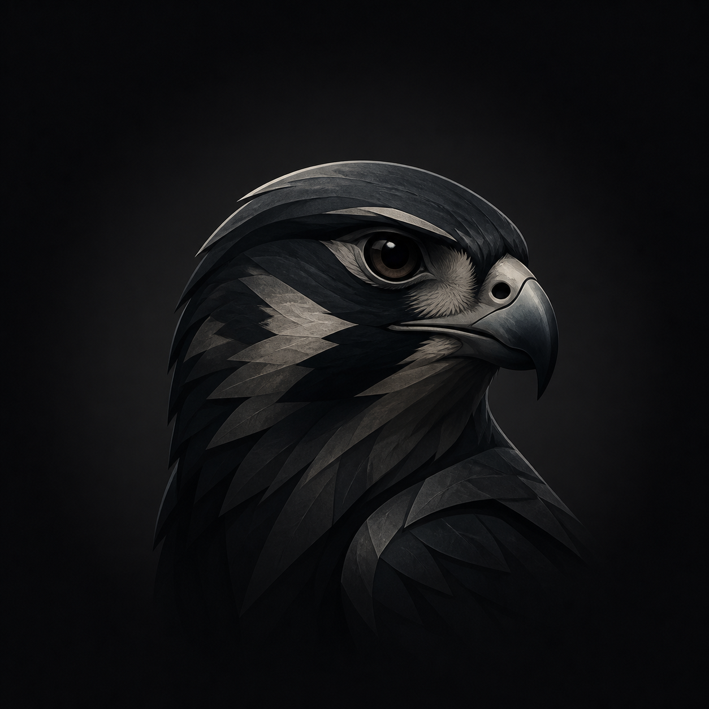
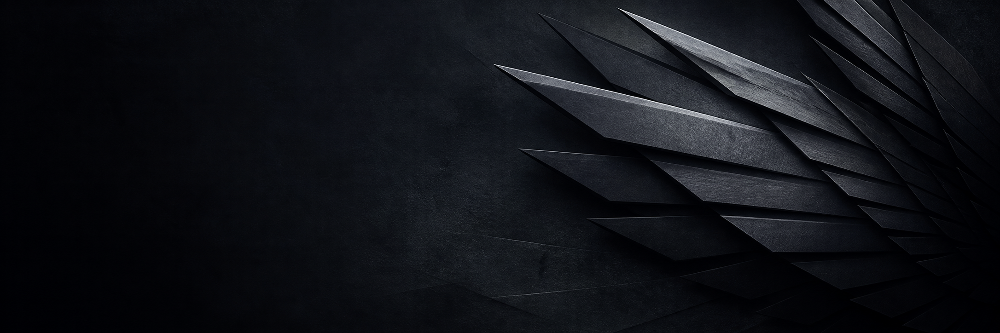

# Public identity assets

This folder contains the canonical visual assets used when CodeVerse is published through the privacy-preserving creator identity **The Sable Falcon**.

## Avatar

Use `the-sable-falcon-avatar.png` without filters, overlays, text, borders, or alternate colors. Let each platform crop the square master to its circular profile shape.

The mark represents observant, deliberate work behind CodeVerse. It is intentionally separate from the CodeVerse product identity: use the CodeVerse name and product screenshots for repository, release, and application pages; use this avatar only for the creator account or byline.

## Header

Use `the-sable-falcon-header.png` as the creator account's wide cover image. Its left-side negative space protects the avatar overlap and responsive crops. Do not add text, product logos, filters, or platform-specific badges; the header should remain usable as future products are launched.

## Identity boundaries

- Display name: **The Sable Falcon**
- Public handle: **[@TheSableFalcon](https://x.com/TheSableFalcon)**
- Byline: **Independent builder of CodeVerse**
- Do not present the identity as a team, company, customer, investor, or unrelated historical figure.
- Do not replace existing Git commit authorship, repository ownership, legal notices, or verified personal accounts with the pseudonym.
- On platforms that require a real member identity, use a CodeVerse project page administered through the existing account instead of creating a false personal profile.
